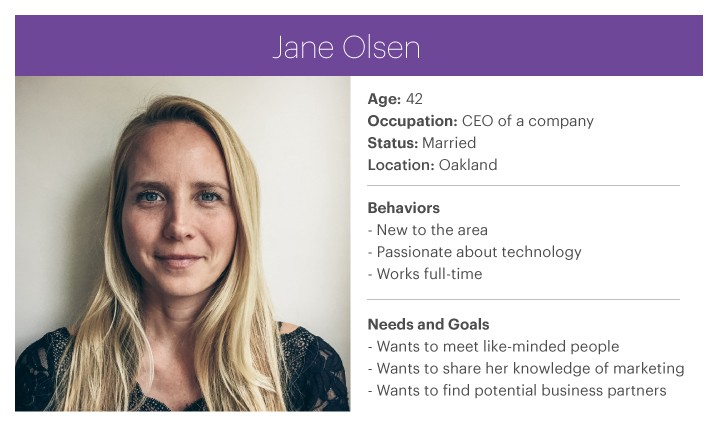

 

{:.table.table-bordered.table-striped.deadline-table}
|Issue date&nbsp;| Monday, 20 August 2018 |
|Final submission &nbsp;| Sunday, 2 September 2018, 23:59 |

## General Overview

In this assignment, you will put on your designer hat and learn how to design a software product, coming up with ideas, features and designs. You will be guided on the various phases in designing your (possibly first) tech product.

## Grading and Admin

This assignment can be done in groups of three or four students. If you are unable to find yourself a group, you will be randomly assigned to one.

This assignment is highly open-ended. We provide milestones so that we can grade your application in a consistent way, even though everyone would be building different apps. This assignment is also designed to introduce you to the various phases of app design and the milestones are there to ensure that you learn about the elements in a structured way. We will also provide some related tips, references and a little bit of help to get you started. These milestones constitute 70% of the assignment's grade.

While the milestones may be easy to meet, simply meeting them will not give you full credit. We ask for quality submissions, not run-of-the-mill work.

To score the coveted remaining 30%, use your creativity to design an application that separates yours from the rest. We will not restrict your potential by restricting the kind of application you can build. We expect that you (pleasantly!) surprise us with what you are capable of doing.

Please do not hesitate to approach the friendly CS3216 staff if you need further assistance. We can be contacted at <cs3216-staff@googlegroups.com>.

## Objectives

The objective of this assignment is to ideate and design an app that solves a real problem, and use empirical user testing to validate your idea and design. Your team will pick and target an audience to solve their problems. You will need to think critically about the features and user interactions within the product, and how each of these supports the user in solving the problem. This is followed by interviewing them to iterate on improving the design and user interactions. The final product will be a document that is sufficiently detailed to be handed off to a developer to be turned into the final working app.

<strong>Warning:</strong> Please read the entire assignment before starting.

## Phase 0

For this assignment, you will be designing and building a mockup of your app's user flow. There are a large number of available UX design tools in the industry. While [Sketch](https://www.sketchapp.com/) is the industry standard, it is not free and available only on macOS.

We have secured a free education edition of [InVision](https://www.invisionapp.com/) for your use. See [Coursemology](https://coursemology.org/courses/1346/) for more information on how to obtain an account.

Note that you are not limited to using InVision. You can use Powerpoint, or even paper and pencil for the wireframe sketches if that's easier for you. Whatever tool you choose, it has to be able to produce a mockup that fulfills all the assignment requirements. In particular, the mockup should be able to **demonstrate** user flow through the app.

  <strong class="milestone-counter">Milestone 0a (Not graded):</strong> Explore the available tools and pick a tool and make sure everyone on your team is familiar with it.

  <strong class="milestone-counter">Milestone 0b (Not graded):</strong> Read through <a href="http://albancarmet.com/portfolio/elly/">http://albancarmet.com/portfolio/elly/</a>. This is to understand the importance of the User-Centered Design process and why we are forcing you to do this assignment in a certain way.

### A note about terminology

Throughout this assignment, we will refer to user flows. In traditional user interface (UI) / user experience (UX) circles, these refer to flow chart diagrams that represent each screen as shapes. However, modern design tools make it easy to build high fidelity mockups, and we will instead refer to what [NN Group](https://www.nngroup.com/) calls [*wireflows*](https://www.nngroup.com/articles/wireflows/) as user flow mockups.

## Phase 1 - User Requirements Gathering

Every good app / platform / website / service begins with a problem they are looking to solve for a target user. As this assignment is due on **2 Sep 2018**, we recommend you pick a target user who is abundantly available around you, e.g. your fellow NUS students. This way you can easily conduct your user testing.

Study your users. Think of a problem/pain point you think they are facing now. List down the problem/pain point and assumptions you have about:

1. Why are they facing this problem
2. How are they living / dealing with this problem now
3. How can your product / service solve this problem
4. What platform (desktop / mobile / app) will best serve to solve this problem?
5. Will your product / service solve this problem in a way that does not cause them more stress, effort and time?

List the above in a *user persona* card. A persona is a fictional representation of an ideal user of your product. You can have more than user persona card if that helps! There is no fixed format for this, but it should contain at the very least:

1. A stick man or portrait (use stock photo)
2. Fictitious name for your user persona
3. Age, gender, current occupation
4. Answers to the problem / pain point and questions above

<small>Source: <https://uxdesign.cc/meetup-a-usability-case-study-e909c33f1e3e></small>

You can fill in more information if you feel it can help you visualize your product, such as personality, brand affiliation, life goals and aspirations, level of experience with technology and more. The goal of the user persona is to allow you to think in the shoes of your user, so try to include details that make this easy.

  <strong class="milestone-counter">Milestone 1:</strong> Pick a primary user persona and list down some assumptions about the problems they’re facing now.

Once you have listed these down, it is time to proceed to user interviews. The goal of this round of interview is to validate your problem and assumptions about your users. While this may seem premature, it is important to remember that the earlier you reject a bad idea, the less costly it is.

* Identify users that fit your user persona cards
* Interview them about the problem(s) you think you are trying to solve
* Validate your assumptions
* Avoid asking leading questions

  <strong class="milestone-counter">Milestone 2:</strong> Formulate a set of questions that you think will help you validate your assumptions and understand the users' needs.

  <strong class="milestone-counter">Milestone 3:</strong> Interview your users and validate your assumptions. Summarize the key findings and conclusions you draw from your interviews.

## Phase 2 - Prototyping

After your interviews, list down at most three **primary user goals** your product should achieve. As a team, brainstorm features that would lead users to achieve these three primary user goals.

The features you pick should answer why they are necessary and how they reinforce your business idea. You should focus on quality and the impact each feature will bring. Products are not successful just because of the number of features they have.

In general, remember that you are building a Minimum Viable Project (MVP) [^1]. The goal is not to build a complete feature set of the product, instead, the number of features should be just enough to test out your idea and validate that it is worth executing on.

A good example is Instagram, which if you follow their [product timeline](https://en.wikipedia.org/wiki/Timeline_of_Instagram), they hit 100k users in a week without things like hashtags and explore.

<strong>Note:</strong> Remember, less is more. If you come up with fifteen features, you are doing it wrong! There should definitely be less than ten features that meet your three primary user goals.

At the same time, you should not miss out on the essentials such as authentication and settings, or the lack thereof. A large part of WhatsApp's popularity was due to simply having the phone number as the user account and their focus on the core essentials of messaging!

  <strong class="milestone-counter">Milestone 4:</strong> Based on the interview results, come up with a list of goals and features for your app.

### Digression: Good Artists Copy; Great Artists Steal

You should do some research before starting to work on the mockups. Professional designers do that all the time. Here are some articles and references to learn more about user interaction design:

- [10 Usability Heuristics for User Interface Design](https://www.nngroup.com/articles/ten-usability-heuristics/)
- [Usability 101: Introduction to Usability](https://www.nngroup.com/articles/usability-101-introduction-to-usability/)

You might also find pattern libraries useful. A pattern library is a collection of user interface design elements, such as a login page, a news feed, a profile page, a credit card entry screen, etc. They are recurring solutions that solve common design problems.

- [Mobbin](https://mobbin.design/) - A website created by fellow School of Computing student [Lim Ji Ho](http://www.jiholim.com/) that showcases the various screens found within popular mobile apps.
- [pttrns](https://pttrns.com/) - Another mobile app UI pattern library with the addition of Apple Watch apps.
- [Material Design Tools](https://material.io/tools/) - Customize and download Material Design icons and theme assets
- [Apple Design Resources](https://developer.apple.com/design/resources/) - Assets and tools for designing for Apple devices

Other good resources for design inspiration include [Dribbble](https://dribbble.com/) and [Behance](https://www.behance.net/), they are websites used by designers to showcase their work. You could think of them as LinkedIn for designers.

------------------------------------------

 

Now it is time to get your hands dirty!

Use any tool you want - even Powerpoint if that’s easier - or just plain paper, markers, and pencil. At this point we value speed over quality since you will likely need to change them based on user feedback, so use whichever tool that allows you to sketch the user flow the fastest.

<iframe width="736" height="414" src="https://www.youtube.com/embed/JMjozqJS44M?start=124" frameborder="0" allow="autoplay; encrypted-media" allowfullscreen></iframe>

Wireframes are ["low-fidelity" mockups](https://www.nngroup.com/articles/ux-prototype-hi-lo-fidelity/). This means that they should *not* contain any design specific elements such as colors, font or unnecessary details like user-generated content and images. These distract from the aspects in which the testing is focused on, and slow down the speed which they are produced. Instead, focus on relative size and position of elements, key user interface elements, and interactions such as which elements can be clicked or tapped, dragged, and so on.

<small>Source: <https://www.flickr.com/photos/anthonyarmendariz/4448219885/in/pool-1070674@N20/></small>

Whichever tool you use to sketch your design, make sure you can "transition" from different screens and states easily. If you are designing on Powerpoint, this means making each screen or state a slide, and if you are designing on paper, use a different page for each screen, and sticky notes for modals, popups and other ephemeral UI elements. Tools like InVision allow for [interactive user flows](https://invis.io/VNNLOH33K25#/163621461_Inbox) which you may use for user testing, but may take longer to build and are not required until milestone 7.

Remember that these mockups will be shown to the user during testing. Do not draw out the links between buttons and screens or let the user see more than one screen at once - after all, users can't do that in the actual app! (You may use these annotations or comments for your own reference, but remember to hide them before starting user testing.)

<small>Source: <https://www.flickr.com/photos/mockupbuilder/12987528713/in/pool-ilovewireframes/></small>

Sketch out the user flows for each of the major features you have listed above. You may have more than one flow for each feature, and the flow can even start from outside your app. When you create your design, keep your user personas in mind.

These are some examples of user flows you may want to sketch out. In some cases you may also have an explicit hypothesis you may wish to test.

* When the user hears about your app from a friend and visits your website or the app store page.
* What should you write on that website to entice users to click the “Sign Up” or “Download App” button.
* When users click Sign Up, what do they see next? What details do they have to fill in? Are you making users go through too many steps before even signing up?
* When users login or use the app for the *first* time, what do they see? What can they click on?
* When users login or use the app for the *second* time, what do they see? What can they click on?

User flows should naturally intersect with each other. This is fine - real apps do not artificially limit the user in which buttons they can press.

  <strong class="milestone-counter">Milestone 5:</strong> Save a copy of your first user flow draft under a folder named "Draft 1". If your draft is hand drawn, scan or take a high-quality photo of it (make sure all important details are visible).

## Phase 3 - User Interviews + Iterations

Now it's time to put your draft design to the test! The test we are conducting is sometimes called ["Wizard of Oz"](https://www.coursera.org/lecture/human-computer-interaction/wizard-of-oz-9f0pI) - we will simulate user interactions by taking the place of the computer. This may seem silly at first, but it is an important tool to validate your design at this stage. Here is a video which shows an example of this form of testing using paper prototypes.

<iframe width="736" height="414" src="https://www.youtube.com/embed/_g4GGtJ8NCY" frameborder="0" allow="autoplay; encrypted-media" allowfullscreen></iframe>

### Playing the Wizard of Oz

You may find it easier go out in pairs to conduct this form of testing. One of you need to act as the computer, so you need a second person to record your results. Test with only one user at a time, not a group. This is to avoid one user’s actions and opinions from influencing the results of other users.

Ask them for five to ten minutes of their time, and if they agree, start by giving them a little context for what you are about to show them. For instance, if the app in question is NUSMods, you might tell them that they have just received a link from a friend telling them to check out a new app for organizing their NUS timetable. You may also give them an explicit goal to accomplish, such as "you would like to sign up for an account".

Instruct them to *think aloud* and use their finger to point at where they will click or tap. A quick way to explain “Think Aloud” to your users is “Vocalize your thoughts. Let us know what you’re thinking throughout the way”. Explain that you will be acting the part of the computer, and reassure them that there is no wrong answer.

Now open the first screen they’re supposed to see. Observe what they click on first, second, third, etc. Remember to "transition" your mockup as they interact with it. **Do not** say anything during the whole process. If users become lost or confused, **let them be lost or confused**. Only prompt them for what they are thinking if it appears that they are not thinking aloud. If they get stuck, simply move onto the next set of mockups.

For any buttons or screens that you have not mocked up, you can reuse any existing mockups and tell the users what they should see - "You clicked the *School of Computing* link. We don’t have those screens today. So please pretend that you see results for the School of Computing on this screen. Okay?". Alternatively, you can describe the result of the action to the user in words instead - "You see a pop up open with a yellow warning triangle, the text 'This will delete your results. Proceed?', and the buttons 'Okay' and 'Cancel'".

Remain as neutral as possible during testing. Only ask follow-up questions **after** the user testing session is completely over. This would be your chance to ask:

* Did you notice button X on this screen?
* Why did you click here and not there? What did you expect to happen when you clicked here?
* You seemed lost on this page. Why were you lost? What did you expect to happen?

Rinse and repeat with three to five [^2] different users.

  <strong class="milestone-counter">Milestone 6:</strong> Record the results gathered from this round of interview. Save these into the "Draft 1" folder together with the sketches.

After you have completed the interviews, it is now time to review the results and improve your user flow. For example, you may want to ask yourself:

* What did the user click on **first**? Was that what you wanted the user to click on **first**?
* Which features did users totally miss? Does that mean those features are not important? If they’re not important, throw them away. If they are, how can you revise your design so users notice the features and actually click on it?
* Are there too many steps for the user to accomplish their goal? At which point did the user become visibly frustrated?
* What assumptions did you make when you create this design? Did the user testing confirm or reject these assumptions?

  <strong class="milestone-counter">Milestone 7:</strong> Review your results and revise your user flow sketch. Save the result in a folder named "Draft 2" and write briefly about how the results from your interview lead to the changes.

As you iterate your design, remember to refine your sketches and improve their quality. Be bold in your earlier iterations. It is perfectly normal to throw out entire screens at this early stage. With each iteration you should solidify your design - while earlier iterations may require large redesign, later iterations should only produce minor tweaks.

## Phase 4 - Design Mockups + More Iterations

Now that you have the basic information architecture and user interactions planned out, it is time to add meat to your wireframe. Convert your wireframe into a high fidelity prototype using your chosen prototyping tool.

<strong>Note:</strong> If you feel that you are not ready for this stage yet, you may perform more rounds of design iteration and user testing. Be sure to include the results and name the folders appropriately.

Compared to a low fidelity prototype, a high fidelity prototype will usually look similar to how the final app will turn out. Colors, fonts, logos, images and user interface elements from the target platform are used in place of wire boxes. Testing with a high fidelity prototype should be the next best thing from testing with a working prototype. This allows for stronger [suspension of disbelief](https://www.nngroup.com/articles/authentic-behavior-in-user-testing/), allowing the user to act more realistically.

<small>Source: <https://www.nngroup.com/articles/wireflows/></small>

You may find it useful to develop a set of shared assets such as the app's logo, color scheme, font and common UI widget so your mockup looks coherent when are built by different members of the team.

Since a high fidelity mockup tries to emulate the final product as much as possible, you should try to make the prototype itself interactive too. Your chosen prototyping tool should allow the user to directly click on elements, which should transition the prototype to the next screen or state. This also frees you from acting as the computer, which gives you more time to observe the user instead.

<small>Source: <http://www.tifftam.co/goji/></small>

A well-developed app has many moving components - log in, sign up, active, inactive states and so on. While you do not have to include every single possibility that your user will encounter, it should be sufficient for your users to test it satisfactorily.

  <strong class="milestone-counter">Milestone 8:</strong> Convert your wireframes into design mockups. Put these in a folder called "Draft 3".

### More testing! More iterations!

Similar to milestone 6, you must now test your high fidelity prototype with real users. At this stage, your prototype should be more complete, so there should be less shuffling around paper or clicking through slides. You can still step in for the computer for any screens or states which you have not added to the prototype, or for interactions like drag and drop which are less easy to prototype, but there should be less intervention on your part.

As you should already be fairly confident in your information structure and basic user interaction, you can instead focus on design details, usability and user experience. For instance, you may wish to check if the chosen color and design of your primary [call to action](https://en.wikipedia.org/wiki/Call_to_action_%28marketing%29) button is sufficiently differentiated and noticeable. In addition, because you are using "production" colors, fonts and UI elements, you can test for a wider range of issues, such as legibility, affordance[^3] and engagement.

 However, remember that the primary goal of the testing is still to observe the user interact with the app. If you need to ask specific questions about elements of the design which the user did not comment on during testing, you should only do so at the end of the test.

  <strong class="milestone-counter">Milestone 8b (Optional):</strong> Conduct two more rounds of user testing and iteration sessions. This means you should have "Draft 3" and "Draft 4", each with their mockups, and their associated user testing results.

## Final Mockups & Assignment Write-up

With the previous draft's user testing results, you should come to a good conclusion on what your MVP should act and look like. The final mock ups should be complete and sufficiently detailed to be handed off to a developer to realize them.

  <strong class="milestone-counter">Milestone 9:</strong> Finalize the mock ups and save them under the folder "Final".
  
  You should also have your final write-up together with your final mock ups.

Your final mock ups should be accompanied by a write-up that describes how your group has met all the milestones for this assignment, summarized all the results and observations from your user testing results and make it easy for the teaching staff to understand how the submitted mock ups are organized.

Also, we want you to take note that the different milestones in Assignment 1 has been structured for you to gain a good sense of what it takes to produce a Product Requirements Document (PRD), a document used in companies (Facebook, Amazon, Google, many other tech companies...) to describe the product being built. The PRD is usually produced and has to be approved before further product development can take place. Once produced, it drives the efforts of the entire product team and the company’s sales, marketing and customer support efforts. 

The broad structure of the PRD is as such:
1. Product Purpose (Milestones 1-3)
- Description of the problem that you are trying to solve
- Who is the product for 

2. Competitive Analysis (Not included in Assignment 1)
- Identify competitors who are launching similar products
- Identify features of competitor's products worth emulating or avoiding
- Identify the ways in which our product's features can deliver greater value than the competition

3. Features (Milestones 4-8)
- Describe each feature at the level of interaction designs and use cases
- Requirement traceability - identifying which requirements are in support of which objective
- Metrics to be measured (Not covered in Assignment 1)

4. Schedule for Product Development (Not covered in Assignment 1)
- Key milestones and overall timeline for product development 

In particular, most of the PRD's importance is in the articulation of the product purpose (Milestones 1-3) and the features built to serve its purpose (Milestones 4-8). This is also what we are focusing on in this assignment. Hence, besides being mindful of how and why Assignment 1 is structured in this manner, you should also illustrate (to the best of your ability) how each feature addresses a particular aspect of a problem that your target user faces - what is known as requirements traceability - to demonstrate that your feature was developed and iterated with thought for the problem faced by the target user and not simply because it's cool or funky.

For further reading regarding PRDs during your free time, feel free to check out this [link](https://svpg.com/assets/Files/goodprd.pdf).

## Phase 5 - Growth Hacking

Growth hacking is defined as the process of rapid experimentation across a marketing funnel, product development, sales segments, and other areas of the business to identify the most efficient ways to grow a business. A common misconception about the term is that it has to do with coding.

A wonderful application is useless if there are no users using it! In this section we will discuss some ways to get users.

### Landing Page

When should you launch a website for your app? If your answer is to launch only after the app has been released, you are missing out! Just like movies trailers, which are released months before the actual launch of the movie, you can launch a landing page, which is a website designed to gauge interest and convert visitors into leads/users.

A landing page should:

- Explain what your app is about and aims to generate interest in it.

- Contain a form that allows you to record a visitor's information. Businesses often promise some sort of deal/promo for the first X users who sign up.

Great examples of attractive landing pages can be found at:

- [19 of the Best Landing Page Design Examples You Need to See in 2018](https://blog.hubspot.com/marketing/landing-page-examples-list)
- [12 Great Landing Page Examples You'll Want to Copy](https://blog.hubspot.com/marketing/fantastic-landing-page-examples)

  <strong class="milestone-counter">Milestone 10:</strong> Design and launch a landing page for your app that is hosted on <a href="https://pages.github.com/">GitHub pages</a>. It should have a sign up form for users to indicate interest (it doesn't have to actually save any data).

Use a CSS framework like [Bulma](https://bulma.io/) or [Bootstrap](https://getbootstrap.com/) to save yourself some time. Remember that the design has to be attractive and that your message has to be succinct! You can even consider landing page creators like [MailChimp landing pages](https://mailchimp.com/features/landing-pages/) to skip all the work.

### Marketing Strategy

A landing page cannot effectively convert visitors into leads/users if there are no visitors to begin with! Going back to the movie trailers example, it would be like creating a movie trailer, but not showing it through public display screens and television advertisements. Hence, you should think of some potential marketing strategies to get the word out about your app.

Positive examples:

- Make promotional videos. View past CS3216 final project videos [here](https://www.youtube.com/playlist?list=PL-0mdQVieeceaFm__nZYSQYzhDGF0C9Jg).
- [Griddit](https://www.youtube.com/watch?v=Jo_2aYXixqs&index=2&t=0s&list=PL-0mdQVieeceaFm__nZYSQYzhDGF0C9Jg), a live chatroom app, got Prof Ben Leong to do an AMA using their service.
- [Letterbox](https://www.youtube.com/watch?v=7TnnLeSPnhA&index=6&t=0s&list=PL-0mdQVieeceaFm__nZYSQYzhDGF0C9Jg) had a member going around the school on an Airwheel and giving out flyers.

DO NOT:

- Paste unremovable stickers on the benches of School of Computing.
- Put up posters in inappropriate places like restrooms.

Videos are not the only way to market an app - to obtain marks in the coveted 30%, think out of the box for non-disruptive, creative and effective marketing strategies. We want a well thought-out marketing plan including details on how you would implement it. Your strategy must obviously be realistic, i.e. do not suggest giving out $10 to each user who downloads your app if you do not have a good plan of getting those funds or a millionaire on your team.

  <strong class="milestone-counter">Milestone 11:</strong> Design a small marketing campaign for your app. Explain which marketing channels you would use and how you would use them to get the word out about your app to attract more users. Provide implementation details (e.g. if you decide to make a promotional video, write out a brief outline of the video contents). Explain why you think your marketing strategy would be effective in gathering users.

## Grading Scheme

In view that this is a brand new assignment, the detailed grading scheme is still being worked out by the teaching staff. We ask for your kind understanding. It is possible that the scheme would evolve as we grade, but not to worry, this assignment is only worth 10% of the final grade and the goal is learn the Product Design process, so don't fret over the grading.

Also, students who dutifully follow all the instructions above and hit all required milestones will obtain 70% of the grade. The remaining 30% will be awarded based on the relative outcomes for the various teams. The top team might be awarded up to 30% while the worst performing team less than 5%.

### Mode of submission

By **2 Sep 2018 23:59** hrs you should upload the following to Coursemology:

- Your write up named `group-<number>-milestones.pdf` containing the answers to milestones 1-4 and 10-11.
- Your mockups and testing results - zipped together - named `group-<number>-mockups.zip`

  As a final reminder, you should have written answers for <strong>six milestones</strong>, <strong>three to four folders</strong> each containing mockup draft, user testing results and conclusions, and <strong>one final mockup</strong> submission. <strong>Failure to adhere to these instructions will result in the deduction of marks.</strong> Only one member of your group needs to submit on Coursemology on behalf of your group.

Clarifications and questions related to this assignment should be posted to the CS3216 Slack channel [#ay1819-assg1](https://cs3216.slack.com/messages/CC6UD93KJ/).

Good luck and have fun!

------------------------------------

[^1]: See <https://blog.ycombinator.com/minimum-viable-product-process/>
[^2]: Does this seem too small a sample? See [Why You Only Need to Test with 5 Users](https://www.nngroup.com/articles/why-you-only-need-to-test-with-5-users/)
[^3]: *Affordances* are an object's properties that show the possible actions users can take with it, thereby suggesting how they may interact with that object.
