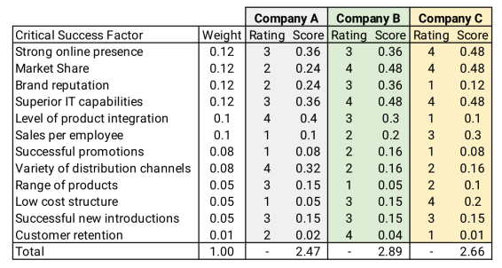
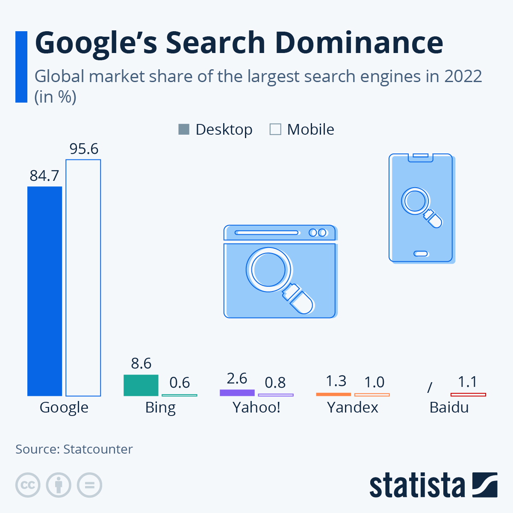

import {Callout} from 'nextra/components';
import assignments from '~/utils/assignments';
import FormattedDate from '~/utils/FormattedDate';
import MilestoneCallout from '~/components/MilestoneCallout';

# Assignment 3 — Artificial Intelligence Application

{assignments.mobile.show_updating_notice && <Callout type="warning"> This assignment is currently being updated. Details are tentative and will be finalised soon.</Callout>}

| Item | Due |
| :-- | :-- |
| Issue date | <FormattedDate date={assignments.mobile.issue} emphasize={false} /> |
| Final submission | <FormattedDate date={assignments.mobile.submission} emphasize={false} /> |

## General Overview

In recent times, the landscape of software development has been profoundly reshaped by the remarkable strides made in artificial intelligence (AI) and, more specifically, generative AI and large language models (LLMs). These advancements have revolutionized how applications are conceived, designed, and experienced, opening up a realm of possibilities that were once confined to the realm of science fiction.

At the heart of this transformation lie LLMs, such as GPT-3.5 and Claude, which stand as towering pillars of AI ingenuity. These models possess an unprecedented ability to comprehend and generate human language with impressive fluency and nuance. As a result, a new era of app development has emerged — one characterized by applications that are not merely tools, but intelligent and empathetic companions.

The key merits of building apps that harness the power of LLMs include:

1. **Natural language understanding and generation**: LLMs enable apps to not only understand user inputs with remarkable accuracy but also respond in a manner that mirrors human conversation. This grants users a level of interaction that transcends traditional interfaces, fostering more engaging and meaningful experiences.
2. **Contextual awareness**: These models possess an inherent understanding of context, allowing apps to tailor responses and actions based on the evolving conversation. This adaptability creates a sense of fluidity and responsiveness, akin to conversing with a knowledgeable friend.
3. **Content creation and enhancement**: Apps can leverage LLMs to generate a wide array of content, from articles and reports to creative writing and marketing copy. This capability has the potential to revolutionize content-driven industries, amplifying efficiency and creativity.
4. **Personalization**: By tapping into the vast expanse of language data, apps can deliver personalized experiences that cater to individual preferences, needs, and emotions. This personal touch fosters a deeper sense of connection and resonance.

Recent enhancements in AI have propelled LLMs to even greater heights. Techniques such as unsupervised fine-tuning and transfer learning have imbued these models with the ability to adapt to specific tasks and domains. Moreover, efforts to democratize AI have led to increased accessibility, empowering a broader spectrum of developers to harness the potential of these models.

In this era of AI-powered app development, the boundaries of creativity are expanding. Whether it's a virtual personal assistant that understands nuanced voice commands, a language-learning app that adapts to each user's proficiency, or a content creation tool that seamlessly generates tailored content, the possibilities are limited only by imagination.

The convergence of LLMs and app development is ushering in a new wave of innovation, redefining the way we interact with technology. As these models continue to evolve and mature, they will undoubtedly leave an indelible mark on the fabric of our digital experiences, enriching and enhancing our lives in ways that were once unfathomable.

As a CS3216 student, you do not want to miss out the opportunity of a lifetime to be at the forefront of this new AI wave!

_P.S. In the spirit of exploring AIs/LLMs, parts of this assignment have been written with the assistance of LLMs 😉._

## Grading and Admin

This assignment can be done in groups of three or four students, which should have been formed by now. If you were unable to find yourself a group, you will be randomly assigned one.

This assignment is highly open-ended. We provide milestones so that we can grade your application in a consistent way, even though everyone will be building different apps. This assignment is also designed to introduce you to the various elements of AI software development, and the milestones are there to ensure that you learn about the elements in a structured way. We will also provide some related tips, references and a little bit of help to get you started. These milestones constitute 70% of the assignment's grade.

With that said, you have a lot of freedom to express your creativity. You are free to develop any idea you like. However, if some of the proposed milestones do not make sense for the application you intend to build, you can petition to replace them with some other deliverables. You are to explain why we should agree to your petition and submit your petition via email at least one week before the assignment is due. **Your petition is subject to approval.**

While the milestones may be easy to meet, simply meeting them will not give you full credit. We ask for quality submissions, not run-of-the-mill work.

To score the coveted remaining 30%, use your creativity to develop an application that stands out from the rest. We will not limit your potential by restricting the kind of application you can build. We expect that you will (pleasantly!) surprise us with what you are capable of doing. Do note that features must fit the aim of your application; ideally, they should be seamlessly integrated.

For example, LLMs can be used to easily add chatbots to any applications, but they may not contribute much value to certain domains. In fact, implementing features for the sake of doing so may work against you (and your grades) as these "non-value add" features detract users from the main purpose of your app.

Please do not hesitate to approach the friendly CS3216 staff if you need further assistance. We can be contacted at [cs3216-staff@googlegroups.com](mailto:cs3216-staff@googlegroups.com).

## Objectives

The high-level goal of this assignment is to utilize generative AI (LLMs in particular) to build a meaningful digital product.

You should approach this assignment with the mindset of an entrepreneur: you own every decision, and each decision you make (from design to engineering) will directly translate to the "success" of your product.

Like all previous assignments, we designed milestones such that you can hopefully have a sense of direction on where we expect you to reach, but these milestones are broadly described so that you are not restricted on how to get there.

In this assignment, your task is to demonstrate that you can design and implement a web application that utilizes the capabilities of LLMs, persist the users' data in the cloud and leverage the user's identity in a meaningful manner.

You should utilize this assignment to showcase your product sense and engineering capabilities. You should also consolidate learnings from Assignment 1 (on Product Design) and Assignment 2 (on identifying innovations, and gaps in the market) to build a fuller product for this assignment.

Remember, your goal is not to do a lot of work. Your goal is to use this opportunity to make a difference.

<Callout>
  Please read the entire assignment before thinking about what you want to
  develop. It may give you a clearer idea of how all the parts come together and
  also a better understanding of the strengths and weaknesses of an AI
  application. The grading scheme can be found at the end of this handout.
</Callout>

## Phase 0: Introduction

### Background

In the ever-evolving landscape of technology, a new wave of applications is emerging, characterized by their innovative use of Generative AI and LLMs. This surge has been led by entities like OpenAI (ChatGPT, DALL-E) and Stability AI (Midjourney) who have demonstrated the potential of AI-generated content and interactions.

Notably, technology giants such as Google, Microsoft, and Meta have fully embraced the AI "arms race" by entering the fray with their own formidable models and chatbots. A clear testament to this paradigm shift was the [recurring theme of AI at Google I/O 2023](https://blog.google/technology/ai/google-io-2023-keynote-sundar-pichai/), underscoring the pervasive influence of AI across industries. As these tech titans continue to dedicate resources to AI research and development, the integration of AI into their existing products is poised to unlock new dimensions of functionality and user experience.

However, the transformative power of generative AI and LLMs is not confined to established players alone. A burgeoning ecosystem of AI startups has taken root, propelling the domain forward with innovative applications primarily in copywriting and customer support. These startups, leveraging the remarkable capabilities of generative AI, are reshaping how businesses communicate with their users to provide support, setting the stage for more personalized and efficient engagement. Case in point – [35% of Y Combinator's 2023 Summer batch were AI startups](https://www.businesstimes.com.sg/startups-tech/startups/y-combinators-latest-batch-35-ai-startups)!

As this new wave of apps, empowered by generative AI and LLMs, continues to unfold, the boundaries of innovation are rapidly expanding. The convergence of AI and human ingenuity is reshaping how we interact with technology, and the journey ahead is going to be really interesting. It's an exciting time to be a software engineer!

### New AI Landscape

Within the generative AI startup landscape, there are a few common categories of products:

- **Text**: Create and manipulate textual content. Tools that can draft articles, generate product descriptions, and even assist in creative writing. Examples: [Copy.ai](https://www.copy.ai/), [Jasper](https://www.jasper.ai/).
- **Image**: Generate, modify, or enhance images. Tools for artists, designers, and photographers to generate artwork, edit photos, and visualize ideas. Examples: Midjourney, Runway ML, Adobe Photoshop.
- **Audio**: Compose music, generate sound effects, and even mimic specific voices.
- **Code**: Assist in software development tasks, including generating code snippets, offering coding suggestions, and even automating parts of the coding process. Examples: GitHub Co-pilot.
- **Chatbot**: Create conversational agents powered by generative AI. These chatbots can engage in natural conversations, answer queries, and provide support. Examples: [Mendable](https://www.mendable.ai/), [Chatbase](https://www.chatbase.co/).
- **Video**: Manipulate and create video content. These tools can be used for video editing, special effects, and even automated video creation. Examples: [Synthesia](https://www.synthesia.io/), [Lumen5](https://lumen5.com/).
- **Data and Analytics**: Analyze and generate datasets for testing and simulation purposes. Query data using natural language. Examples: [Defog](https://defog.ai/).
- **Agents**: Create virtual agents powered by generative AI. These agents can emulate human interactions and assist with tasks like scheduling, information retrieval, and more. Examples: [Cognosys](https://www.cognosys.ai/), [Spell](https://spell.so/).
- **Gaming**: Create dynamic game environments, generate levels, adapt game mechanics based on player behavior, NPCs can engage in personalized conversation with players.

While most companies are part of the AI "gold rush", some prefer to follow the saying "during a gold rush, sell shovels". These "shovel" companies build services around LLMs, selling API access to LLMs and platforms to make it easier to build AI products:

- **APIs**: Access to the LLMs hosted on the cloud. Examples: ChatGPT & GPT-3.5 by OpenAI, Claude by Antropic, Command by Cohere.
- **Toolchains**: Simplify common LLM-related operations. Examples: LangSmith by LangChain, Cohere platform, Humanloop.
- **Vector databases**: Stores data in a format that enables semantic information retrieval and long-term memory for LLMs. Examples: Supabase Vector, Pinecone, Weaviate.


_Source: [https://www.antler.co/blog/generative-ai](https://www.antler.co/blog/generative-ai)_

Other lists to find AI products:

- [152 Fun AI Tools You've Never Heard Of](https://www.synthesia.io/post/ai-tools)
- [Antler Gen-AI Landscape](https://airtable.com/shrBeWpMlxf3e14E8/tblS4TkbJbm0cqT0o)
- [There's An AI For That](https://theresanaiforthat.com/)

<Callout type="warning">
  For this assignment, you are required to use LLMs to build an AI software
  product as LLMs are easy to get started with, and require less server
  resources as compared to other forms of generative AI like image/audio
  generation.
</Callout>

## Phase 1: Product Strategy

### Idea Generation, Problem Space

As an aspiring entrepreneur of CS3216, you have a mind full of big ideas eagerly waiting to see the light of day. After a long discussion with the team about the unlimited potential of your new product, you are now more sure than ever that this is going to be the next big thing. You expect more users than ChatGPT, TikTok, Netflix, and Pokemon Go combined, and to keep this many people waiting for any longer is simply evil.

Before you jump into developing the specifications of your application, a very important question to ask yourself is, "Does my application solve any problem for the users?". An application that has many superfluous features does not make it useful. Just because your application has a cool concept or uses the latest technology does not guarantee that the initial users who joined out of curiosity will stay on. On the contrary, if a less fancy but more practical solution makes the user's life easier, it is more likely that the user will be retained. Solve a problem that people care about, solve it well, and fans of your application will naturally accumulate. Your users become the advocates that will help you spread the message about your application via word-of-mouth.

When deciding on the problem space that you want to build for, it is also helpful to consider the **market attractiveness**. Is this an attractive market to enter? In order to assess a market's attractiveness, you can look into the market size, and its expected growth rate. The market attractiveness of the problem space you intend to tackle can guide you on the expected "impact" that your product can potentially bring.

Guides on estimating the market size can be found all over the internet, and a useful one we found is [https://pear.vc/market-sizing-guide/](https://pear.vc/market-sizing-guide/).

<MilestoneCallout labelSuffix="(Compulsory, not graded)">
  Describe the problem that your application solves.
</MilestoneCallout>

### Competitive Landscape

Understanding the competitive landscape provides critical insights into existing market players, their offerings, strengths, and weaknesses. By comprehending competitors' strategies and customer perceptions, you can likely make informed decisions, anticipate challenges, and tailor your approach to effectively capture market share and deliver unique value to their target audience.

The AI product ecosystem is very crowded, and new AI companies are emerging everyday. This statement will continue to be accurate for years to come.

While AI has undoubtedly opened doors to a multitude of possibilities, it has also given rise to the phenomenon of "thin wrapper" products. These products often rely heavily on existing AI frameworks and APIs, offering minimal value beyond the underlying technology. In this assignment, you **should not** create such products as they can be easily cloned, leading to a lack of differentiation and diminished long-term viability.

In trying to understand the competitive landscape, you may find it useful to do a competitive analysis. Questions you may find useful include:

- In the problem space that you are trying to "enter", is the market competitive?
- Will you be able to capture meaningful market share?
- How much market share does each competitor have?
- What are the competitive advantages of your competitors?

<Callout>
  
**Good-to-know!**

You may consolidate your findings into a Competitive Profile Weighted Matrix to better gauge your competitors' products (_Not graded_).

The competitive profile matrix is used commonly by strategic management to compare their firm with major players of the industry. In order to do a competitive profile matrix well, you need to identify what are the **key success factors** that determine your product's success in the market, and use these factors to compare your competition.



_Source: [https://thinkinsights.net/strategy/competitive-profile-matrix/](https://thinkinsights.net/strategy/competitive-profile-matrix/)_

</Callout>

<MilestoneCallout>
  List down your 3 closest competitors and their pros and cons. Explain how your
  product is better.
</MilestoneCallout>

### Product Capabilities

Building a killer application requires more than just technical skills. In CS3216, you are expected to think very hard about what you're trying to do. You should not be building an application just because you need to submit this assignment.

You should choose an application that fully utilizes the potential of the chosen technology. In CS3216 (and life in general), execution matters. Choosing the most suitable platform for your application is part of the execution. Thus, we expect you to come up with a good reason as to why using LLMs would best achieve your application's objectives.

In addition to LLMs, it is a requirement that your application has **user authentication**, and makes use of user authentication meaningfully. From the assignment standpoint, we are looking for products that are more than one-page tools. From a product standpoint, having user authentication should increase your ability to provide personalization features, and forces you to consider the security aspect to protect your users' data. You should also therefore include reasons why having user authentication alongside LLMs can help you achieve your application's objectives.

A common pitfall for engineering-focused students is their bias towards technologically-complex products, failing to consider how the product "serves" the problem in the process. The focus here is for you to consider your product's capabilities - does your product have the capabilities to succeed in your chosen problem space?

<Callout type="warning">

All teams should first submit a brief [email](mailto:cs3216@googlegroups.com) of the proposed product to the teaching team for approval before starting on the project!

</Callout>

<MilestoneCallout>
  Describe your application briefly. List its objectives and the associated
  (major) user stories.
</MilestoneCallout>

### Moat

In the context of product strategy, a "moat" refers to a sustainable competitive advantage that a product possesses, which helps protect its market share and profitability from competitors. Just like a moat around a medieval castle provides protection and makes it difficult for enemies to breach the walls, a business "moat" creates barriers that deter competitors from easily entering the market or replicating the company's success.

A moat can take various forms, including (but not limited to):

- Brand
- Technological Innovation
- Economies of Scale
- Investor Confidence
- Ethics and Responsible AI
- Customisation and Personalisation

For example, one of Google's moat is its advantage of scale. Google Search continues to dominate the search engine market.



_Source: [https://www.statista.com/chart/29267/market-share-of-the-worlds-largest-search-engines/](https://www.statista.com/chart/29267/market-share-of-the-worlds-largest-search-engines/)_

One of Apple's moat is its integrated ecosystem of products. Apple's products, from iPhone, Macs, and services like iCloud, are tightly integrated into a single ecosystem, creating a seamless user experience that is difficult for competitors to match. This tight integration also makes it difficult for consumers to switch out of Apple.

Disney's intellectual property and content library forms a significant moat. Disney owns the intellectual property of various iconic characters, like Mickey Mouse, to beloved franchises like Star Wars and Marvel. This competitive advantage cannot be easily eroded.

Closer to AI products, ChatGPT has multiple "moats", including:

1. **First-mover advantage**. Being the first-mover, it has gained a strong "brand recognition" as consumers remember and trust it as the pioneering product - it is challenging for competitors and later entrants to establish the same level of recognition.
2. **Developer-friendly APIs**. OpenAI offers APIs that allow developers to easily integrate ChatGPT into their applications, products, or services. This developer-friendly approach facilitates the use of ChatGPT's capabilities without requiring extensive AI expertise.
3. **Demand Scale**. The widespread use of ChatGPT and the large volumes of interaction contribute to its data collection and training improvements, enhancing the model's performance over time.

For startups especially in the AI sector, establishing a moat is essential to stand out in a rapidly evolving landscape.

<MilestoneCallout>
  What's your secret sauce / moat? What's your strategy to prevent competitors
  from cloning your app? What's your strategy against big players ripping off
  your product?
</MilestoneCallout>

## Phase 2: Go-To-Market

### Product Lifecycle & Product-Market Fit

The product life cycle, a term commonly used by marketing professionals and management, describes the stages of a product when it is first introduced to the market, up to when the product is sunsetted. In this assignment, your product is positioned in the **introduction stage**, a period which demands your proactive engagement with prospective users in your target market to persuade them to become your first-time users.

While the primary goal of the introduction stage is not necessarily to achieve an optimal product-market fit, it does lay the foundation for eventually reaching that fit in the growth stage and beyond.

During the introduction stage, the focus is more on creating awareness, generating interest, and attracting early adopters. The product may not have achieved its perfect fit with the market at this point, but it is a crucial period for collecting feedback, understanding user preferences, and making initial adjustments to move closer to that ideal fit.

Therefore, a **user acquisition plan** should allow you to reach out to more users in your target market segment.

Your user acquisition plan might also influence the features that you include in your application. For example, you could think of ways to provide motivation for users to share your application with their friends; you could design features such that while individual users may derive some value using your application, it is also in their interest to promote your application (e.g. rewarding users for referrals).

Illuminate the strategies, channels, and tactics you intend to employ to captivate and convert potential users into loyal patrons. As you delve into this milestone, articulate how your understanding of your target users informs your approach and elucidate the measures you will implement to foster a compelling product-market fit.

**Note:** You should approach this milestone by describing your strategy or plan on how you intend to "bring" this product to market, utilizing all resources you have.

<MilestoneCallout>
  Describe your target users. Explain how you plan to acquire your target users.
</MilestoneCallout>

### Scoping

With the key problem and target users at the forefront of your mind, it is timely to discuss what features should go into the product submitted for Assignment 3.

You would realize that time-to-submission is extremely limited. Just as real companies must navigate the constraints of deadlines and customer expectations, you will be required to optimize the use of your time in Assignment 3 to deliver a simple, lovable and complete Minimum Viable Product (MVP).

In this pursuit, the art of **scoping** takes center stage.

Scoping is the process of carefully selecting specific features to be included. In scoping and selecting features, justification is important: this requires a keen understanding of user needs, potential impact, and the overarching project goals. In this process, some questions you may find useful include:

1. **User Experience:** How does each proposed feature address a specific user pain point or problem? What value does it bring to the user experience or overall product? _(Not graded)_
1. **Resource:** What are the resource implications (time, effort, cost) of including each feature? Are there technical limitations or dependencies that need to be considered? _(Not graded)_
1. **User Impact:** How many users will benefit from each feature? Is the feature essential for a significant portion of the user base, or is it a niche requirement? _(Not graded)_
1. **Competitive Advantage:** Will the inclusion of a particular feature give the product a competitive edge in the market? How does it compare to what similar products are offering? _(Not graded)_

Given that you are introducing a new product, the **initial scope** is extremely important. By having a first set of features, you can develop the MVP, release it to users, gather feedback, and thereafter iteratively refine the product. This process aligns seamlessly with the agile methodology, where "agility" empowers teams to respond swiftly to changing market dynamics and evolving user preferences.

As you set out to prioritize features for the MVP, it is important to carry out a delicate balancing act with time. The features chosen must align harmoniously with your MVP, so that the core functionalities are addressed comprehensively. Yet, you must simultaneously stay keenly aware of time constraints.

Therefore, a key part of scoping also includes planning and estimation. You can use this assignment as a chance to grow in your ability to dissect a project into actionable tasks, foresee potential challenges, allocate resources judiciously, and estimate timeframes. These skills enable project managers, product leaders, and engineers to craft realistic timelines, allocate resources optimally, and identify potential bottlenecks before they impede progress.

You can consider dividing the 3-4 weeks into sprints, and use one sprint to better estimate the workload required for the next. That said, since this is a short project, strictly adhering to the sprints may impede your success. It is up to you to decide what works best for your MVP.

<MilestoneCallout>
  List down the features that should go into the MVP (your assignment
  deliverable). How did you decide on them? What are future features and
  expansions you can think of?
</MilestoneCallout>

### Business Model

In any problem, a real consideration is whether the investment in the product will be "successful". Few things impact the "success" of your product as much as pricing.

The determinant of "success" differs as the product enters different stages of growth. Most of the time, we want to maximize the profits of a product. However, there are times when a company would want to instead maximize market share, or number of users.

Depending on your goals, your pricing strategy to achieve "success" differs.

Generally, there are three ways to price:

1. Pricing based on costs
   - How much does it cost to produce and maintain your product?
   - What is the profit margin that you are aiming to achieve?
2. Pricing based on value
   - What benefits does this product provide to its users?
   - How much "value" does this provide to users?
3. Pricing based on competition
   - How much do competitors price their products for?
   - How does your product compare?

Coming up with a monetisation strategy is useful from the get-go. It allows you to evaluate what is the most suitable price for which stage of product you are at. For example, a consideration for a product in the early stage is market share, and also how long would it take to break even.

In the digital product market today, there are multitude of ways to price. Here are some blog articles we felt were useful to helping you ideate on your pricing strategy:

- [The Ultimate Guide To Saas Pricing Models, Strategies & Psychological Hacks](https://www.cobloom.com/blog/saas-pricing-models) considers seven of the most common way digital SaaS products are priced today.
- [Mapping the Generative AI landscape](https://www.antler.co/blog/generative-ai)'s section on "Looking into the future—Gen-AI revenue models".

**Note:** It is possible that the currency of "success" may not always be the dollar. You are not restricted to build a product that has the dollar as its currency of success. If not the dollar, what are some other metrics you can use to consider? E.g. If you build a social chat bot, then a key metric to determine success could be the volume of messages.

<MilestoneCallout>
  Come up with a monetization and pricing strategy (e.g. tiers and features).
  Explain why you think this pricing strategy is suitable for your target users
  and problem space. Explain the factors that influenced your pricing decisions,
  such as production costs, perceived value, competition, etc. It would be
  useful here to consider possible revenue streams of your product.
</MilestoneCallout>

## Phase 3: Artificial Intelligence Integration

### Introduction to Large Language Models

LLMs are a type of artificial intelligence technology designed to understand and generate human-like text based on the input they receive (a prompt). These models are built using deep learning techniques, particularly a type of neural network architecture called transformers.

Transformers are a class of deep learning models that have revolutionized natural language processing (NLP) tasks. They excel at handling sequential data, such as text, and have become the foundation for many state-of-the-art language models. One of the most well-known and influential transformer architectures is the Generative Pre-trained Transformer (GPT), developed by OpenAI.

LLMs like GPT-3 (the third iteration of the GPT series) have billions of parameters, which are tunable components that the model learns from massive amounts of text data. These parameters allow the model to capture complex patterns and relationships within language, enabling it to perform a wide range of language-related tasks, such as:

- **Text generation**: LLMs can generate coherent and contextually relevant text based on a given prompt or seed text.
- **Language translation**: They can translate text from one language to another.
- **Summarization**: LLMs can produce concise summaries of longer pieces of text.
- **Question answering**: They can answer questions by extracting relevant information from a given text.
- **Text classification**: LLMs can classify text into predefined categories or labels.
- **Sentiment analysis**: They can determine the emotional tone or sentiment expressed in a piece of text.
- **Chatbots and conversational agents**: LLMs can simulate human-like conversations and provide interactive responses.
- **Code generation**: They can generate code snippets based on high-level descriptions.

The training process for these models involves exposing them to vast amounts of text data and having them predict the next word or token in a sequence. This process enables the models to learn grammar, syntax, semantics, and even some aspects of world knowledge from the data.

LLMs are revolutionary as compared to traditional machine learning techniques because they can/are:

- **Perform more diverse and complex tasks**: Traditional machine learning models are typically limited to performing simple tasks, such as classification or regression. LLMs, on the other hand, can perform more complex tasks, such as text generation, translation, question answering, all through a single and flexible natural language prompt.
- **Readily available and accessible**: Many LLMs are made available through APIs, making their capabilities accessible to a broader range of developers without requiring much experience / deep expertise in machine learning. These diverse capabilities can be accessed through natural language, no learning of new syntax or documentation needed.
- **Trained on a vast scale of data**: Traditional machine learning models are typically trained on a small dataset of labeled data. This can be limiting, as it may not be representative of the real world. LLMs, on the other hand, can be trained on a massive dataset of unlabeled data. This allows them to learn the statistical relationships between words and phrases without being explicitly told what they are.
- **Few-shot and zero-shot learning**: LLMs can perform new tasks with minimal examples or even zero examples by leveraging their pre-trained knowledge and generalizing to new tasks or categories without the need for extensive task-specific training data. This capability is particularly valuable in scenarios where acquiring labeled training data is expensive, time-consuming, or impractical, whereas traditional machine learning often requires a substantial amount of labeled data for each task.
- **Understanding language**: LLMs can understand nuances in languages, including idioms, metaphors, and cultural references, which is a challenging task for traditional models.

Resources:

- [A Compact Guide to Large Language Models — Databricks](https://www.databricks.com/sites/default/files/2023-06/compact-guide-to-large-language-models.pdf)

<MilestoneCallout>
  Explain how you are using LLMs in your product and why LLMs are a good
  approach to meet the product's objectives.
</MilestoneCallout>

### Prompt Engineering/Design

A prompt is a specific input or instruction given to a language model to guide its behavior and generate desired output. In the context of LLMs, such as GPT-3, a prompt serves as the initial text or question that you provide to the model to elicit a response or generate text based on that input.

Prompts can take various forms depending on the task you want the LLM to perform. They can be as short as a single sentence or as long as a paragraph. The key is to provide clear and contextually relevant instructions that guide the model toward producing the desired output.

As prompts are the main interface between users and the LLMs, the importance of writing a good prompt cannot be overstated. The choice of words, phrasing, and clarity of the instruction can significantly influence the quality and relevance of the generated output.

#### Elements of a Prompt

A prompt typically includes several elements that help guide the response or output generated by the LLM. Here are some common elements of a prompt:

1. **Topic/subject**: The topic or theme of the prompt provides a broad area of focus for the response. For example, a prompt might ask a language model to generate text about a specific topic like "climate change" or "artificial intelligence."
2. **Task/goal/purpose**: The task or goal of the prompt specifies what kind of response is desired. Is it to persuade, inform, entertain or something else? For example, a prompt might ask a language model to generate a persuasive essay on a particular topic or to write a short story that meets certain criteria.
3. **Target audience / perspective**: The target audience of the prompt identifies the intended audience for the response. For example, a prompt might ask a language model to generate text that is suitable for a general audience or for a specific age group. For example, "Respond as if you are a teacher providing advice to a student."
4. **Tone/style**: The tone or style of the prompt can influence the tone or style of the response. For example, a prompt might ask a language model to generate text that is formal, informal, humorous, or serious.
5. **Context / background information:** Providing relevant background information helps set the stage for an informed response.
6. **Length/format**: The length or word count of the prompt can specify the amount of content that is expected in the response. For example, a prompt might ask a language model to generate a response that is between 500 and 1000 words.
7. **Specific instructions/guidelines**: The prompt may include specific instructions or guidelines that must be followed in the response. For example, a prompt might ask a language model to generate text that includes specific keywords or phrases, or that adheres to a particular format or structure. For example, "List 3 reasons why..."

By including these elements, a prompt can help guide the response generated by a language model or AI system, while also providing a degree of flexibility and creativity in the output. The most effective prompts will combine several of these elements to provide enough direction without overly restricting the response. Vague or overly broad prompts can lead to unfocused and inconsistent responses.

Prompt engineering is a broad topic and cannot be covered sufficiently within an assignment writeup. Here are some recommended resources for learning more about prompt engineering:

- [Best practices for prompt engineering with OpenAI API](https://help.openai.com/en/articles/6654000-best-practices-for-prompt-engineering-with-openai-api) by OpenAI. One-pager that goes straight to the point, with examples.
- [GPT best practices](https://platform.openai.com/docs/guides/gpt-best-practices) by OpenAI. A longer list of techniques and best practices.
- [ChatGPT Prompt Engineering for Developers](https://www.deeplearning.ai/short-courses/chatgpt-prompt-engineering-for-developers/) by DeepLearning.AI. This video-based course takes around an hour to complete and Yangshun has written a summary of the important points: [Part 1](https://www.linkedin.com/feed/update/urn:li:share:7060809050602569728/) & [Part 2](https://www.linkedin.com/feed/update/urn:li:activity:7060818037679017985/).
- [Prompt Engineering Guide](https://www.promptingguide.ai/) by DAIR.AI. Well-rounded useful guide that covers Prompt Engineering and various topics related to LLMs.
- [Prompt Engineering Guide](https://github.com/brexhq/prompt-engineering) by Brex. Tips and tricks for working with LLMs like OpenAI's GPT-4.
- [Prompt Engineering](https://docs.cohere.com/docs/prompt-engineering) by Cohere.

Prompt engineering is just one of the concepts relevant to using LLMs effectively. Some other important concepts include:

#### Tokenization

Tokens in the context of LLMs refer to the individual elements or units of language that the model processes and generates. These tokens can be subwords, words, or characters, and they are the basic building blocks of the language that the model understands and generates.

For example, in a language model that uses subwords as tokens, each subword would correspond to a specific part of a word, such as a prefix, suffix, or root. The model would then use these subwords to generate words and sentences by combining them in different ways.

In contrast, a language model that uses words as tokens would process and generate complete words, rather than subwords. And a model that uses characters as tokens would work with individual characters, such as letters or digits, to generate text.

The choice of token granularity can affect the performance of the language model, as well as the type of tasks it can be used for. For example, a model that uses subwords as tokens may be better at generating words and sentences that contain prefixes and suffixes, while a model that uses words as tokens may be better at generating complete sentences and paragraphs.

It's worth noting that the tokenization of language can be a complex process, and different models may use different tokenization strategies depending on the specific task and the type of language they are processing.

Both input and output tokens make up the total number of tokens in an API call, which affects:

- How much the API costs, as LLM providers usually charge per token.
- How long the API call takes, as more time is needed if there are more input tokens to process and output tokens to generate.
- The functionality of the API call, since the total tokens must remain within the model's maximum threshold (e.g. 4096 tokens for `gpt-3.5-turbo`).

Further reading on tokens:

- [GPT - OpenAI API](https://platform.openai.com/docs/guides/gpt/managing-tokens)
- [Tokens | Cohere](https://docs.cohere.com/docs/tokens)

#### Fine-tuning

One of the techniques to improve prompt design is called "few-shot prompting", which is to provide examples within the prompt. With fine-tuning, examples (training data) can be provided to a model outside of the prompts and the model is being "fine-tuned". Prompts to a fine-tuned model will make use of the training data when generating output. These fine-tuned modules result in:

1. Better results than prompt design.
2. Ability to train on more examples than can fit in a prompt.
3. Token savings due to shorter prompts.
4. Lower latency requests as there are fewer tokens to process.

Fine-tuning is an improvement over few-shot learning as many more examples can be provided and don't count towards prompt tokens. Once a model has been fine-tuned, you won't need to provide as many examples in the prompt. This results in faster and cheaper requests.

In general, fine-tuning involves the following steps:

1. Prepare and upload training data
2. Train a new fine-tuned model
3. Use your fine-tuned model

Fine-tuning is specific to models and not every LLM API offers the functionality. As of Aug 2023, OpenAI allows fine-tuning for `gpt-3.5-turbo`.

Further reading on fine-tuning:

- [Fine-tuning - OpenAI API](https://platform.openai.com/docs/guides/fine-tuning)

<MilestoneCallout>
  Give two to three examples of prompts you used and explain how you designed
  them to be effective. What techniques did you use to improve the effectiveness
  of your prompts?
</MilestoneCallout>

### Using the Right Model for the Job

Not all models are built equally. Each model has its own advantages, limitations, and customization parameters. The key is to find the most suitable model for your application.

#### Popular LLMs and Providers

- **[OpenAI](https://platform.openai.com/overview)**: OpenAI is one of the pioneers in the field of LLMs and needs no further introduction. They have released a number of LLMs, including GPT-3 and GPT-4. OpenAI's LLMs are known for their large size and their ability to generate realistic and creative text.
- **[Command](https://cohere.com/models/command) by [Cohere](https://cohere.com/)**: Cohere develops an LLM called Command and their platform offers a huge range of services that can be viewed as a batteries-included version of OpenAI API.
- **[Llama 2](https://ai.meta.com/llama/) by [Meta AI](https://ai.meta.com/)**: Open source LLM by Meta that's free to use. There's no official hosted API available so if you want to use it you will need to host it yourself.
- **[Hugging Face](https://huggingface.co/)**: Hugging Face is a community-driven platform for LLMs. They provide a number of tools and resources for developers who want to use LLMs. Hugging Face's LLMs are known for their diversity and their availability.
- **[Bard](https://bard.google.com/) by [Google AI](https://ai.google/)**: While ChatGPT's data is only up till September 2021 (using GPT-3.5), Bard which is a chatbot by Google uses PaLM 2 and is based on real-time current events pulled from Google Search. However, Bard API access is still in beta and [requires a Google Cloud project](https://www.cloudbooklet.com/googles-bard-api-key/).
- **[Claude](https://claude.ai/) by [Anthropic](https://www.anthropic.com/)**: Claude is an LLM developed by Anthropic, a company that is focused on developing safe and beneficial artificial intelligence. As of Aug 2023, the API is not yet generally available.

[Vercel AI Playground](https://sdk.vercel.ai/) allows you to compare output of different models by the various providers using the same prompt. Super handy!

When choosing LLMs and providers, it is important to consider your specific needs and requirements. Some factors to consider include the type and size of the training data, the type of applications you want to build, context window size (maximum tokens allowed), and the price per token.

<Callout type="warning">

Chances are, the LLM API you're using isn't free. However, the costs should be quite low for an assignment's usage volume. If you're facing difficulties gaining access to the APIs, please email the teaching staff.

</Callout>

#### Model Settings

Beyond prompt design, most LLM models also provide the following settings to allow for more control over the output:

- **Max tokens**: The maximum number of tokens to generate.
- **Temperature**: Temperature is a hyperparameter in language models that controls the creativity and diversity of the generated text. A high temperature means that the model is less confident in its predictions, and will therefore generate text that is more creative and diverse, but may also be less accurate and random. A low temperature means that the model is more confident in its predictions, and will therefore generate text that is more accurate and consistent. The best temperature setting will depend on the specific application. For example, if you are using a language model to generate text for a news article, you would want to use a low temperature to ensure that the output is factually accurate and grammatically correct. However, if you are using a language model to generate creative text, such as poetry or fiction, you might want to use a higher temperature to allow for more creativity and diversity.
- **Top-P**: Top-P limits the probability mass that is considered when sampling. For example, if you set Top-P to 0.75, then the model will only consider tokens whose probability is at least 75%. This can help to reduce the randomness of the output and make it more likely that the model will generate text that is relevant to the prompt. It is recommended to customize either temperature or Top-P, not both.
- **Frequency/presence penalties**: Coefficients that penalize tokens based on how much / whether they exist in the text to reduce the likelihood that they show up again.

<MilestoneCallout>
  Justify your choice of LLM and provider by comparing it against at least two
  alternatives. Explain why the one you have chosen best fulfills your needs.
  Elaborate on your choice of model parameters.
</MilestoneCallout>

### Other Resources

Using LLMs comes with some inconveniences such as unstructured output, preserving context and memory across completions, and a huge amount of boilerplate code. Here are some tools that can help during development with LLMs:

- [LangChain](https://www.langchain.com/): LangChain is a powerful tool that can be used to build a wide variety of applications that use LLMs. It has abstractions to achieve common LLM operations quickly such as loading/transforming/storing data, sequential operations on data, remembering previous interactions, and acting on LLM output.
- [Vercel AI SDK](https://sdk.vercel.ai/docs): An open source library designed to help developers build AI-powered user interfaces in JavaScript and TypeScript. It makes building streaming-based AI chat user interfaces effortless.
- [TypeChat](https://microsoft.github.io/TypeChat/): TypeChat helps get well-typed and structured responses from LLMs without the need to parse the output yourself.

[DeepLearning.AI](https://deeplearning.ai/) by Andrew Ng provides a [series of short practical-focused courses on generative AI](https://www.deeplearning.ai/short-courses/) if you prefer video lesson style learning that includes some hands-on exercises using Jupyter Notebook.

These platforms improve the experience of using LLMs though they might be overkill for your assignment/projects:

- [LangSmith](https://www.langchain.com/langsmith): By the creators of LangChain, LangSmith helps you visualize, debug, and improve your LLM apps.
- [Humanloop](https://humanloop.com/): A platform that empowers teams to build reliable and performant AI systems by providing monitoring, A/B testing, a collaborative prompt workspace, private data storage, and fine-tuning.

## Phase 4: Design

Design here refers to many things: branding, technology/engineering, and the product.

### Branding your Product

Every product has a name. This name is how people find, refer, and remember the product. Most products have logos. This logo is how people recognize and associate relationships with the product. Names, logos, color schemes, fonts, etc. of a product or company collectively form a persona to which people can relate and associate. This persona is exactly a brand.

A brand encompasses the essence of a company: its values, promises, and the emotional connection it establishes with its audience. With the vast number of companies and products in today's competitive business landscape, these sentiments are almost always never accidental, rather carefully crafted and tested over hundreds of iterations.

Think McDonald's golden arches. It transcends language barriers and cultural differences. They embody the company's promise of consistency, quick service, and affordability. When people see those golden arches, they immediately associate them with familiar tastes, convenience, and an entire spectrum of shared experiences. You yourself would probably remember memories of your first date, gathering with friends, or late night supper when crunching due assignments. In this aspect, McDonald's golden arches are more than just a logo; they capture feelings, stories, and memories.

Some brands even become linguistic cues. When you want to find out about something, you'd _google_ it. If you missed the bus and train, you'd _grab_ to the office. If you want to express your frustration with Ruby on Rails or Angular, you'd _tweet_ about it. Oh, look; this place is so picturesque, it's _instagrammable_! And the example goes even deeper with cultural contexts. In Indonesia, people colloquially refer to laundry detergents as "[rinso](https://en.wikipedia.org/wiki/Rinso)" rather than the dictionary translation _deterjen pakaian_, or baby diapers as "[pampers](https://en.wikipedia.org/wiki/Pampers)" rather than _popok bayi_. In Singapore, people colloquially refer to instant noodles as "[maggi](https://en.wikipedia.org/wiki/Maggi) mee", or recently, video conferencing as "[zoom](https://en.wikipedia.org/wiki/Zoom_Video_Communications) calls". The list goes on: [velcros](https://en.wikipedia.org/wiki/Hook-and-loop_fastener) (hook-and-loop fasteners), [aspirin](https://en.wikipedia.org/wiki/Aspirin) (acetylsalicylic acid), [xerox](https://en.wikipedia.org/wiki/Xerox)ing (photocopying), [scotch tapes](https://en.wikipedia.org/wiki/Scotch_Tape) (adhesive tapes), [post-it notes](https://en.wikipedia.org/wiki/Post-it_Note) (sticky notes), [band-aids](https://en.wikipedia.org/wiki/Band-Aid) (bandages), [q-tips](https://en.wikipedia.org/wiki/Q-Tip) (cotton buds), etc. Notably, the brands that form these verbs or nouns are often recognized as the standard of their respective product categories. This is the power of a good brand. They not only evoke feelings and trust, but also bring revenues.

These reasons are why it is important to build a good brand. Even choosing names is often tedious. Think about:

- **Length of the name**. Will it be too hard to remember?
- **Reproducibility of the name by spelling**. If A were to hear B say "I use Whatchamacallit to build this website," would A be able to type it and find it on search engines?
- **Domain name availability**. Some may even get clever with [domain hacks](https://en.wikipedia.org/wiki/Domain_hack), e.g., [del.icio.us](<https://en.wikipedia.org/wiki/Delicious_(website)>), but can it be easily shared verbally?
- **Social handles availability**. Is @mynextstartup available on major social media sites, e.g., Instagram, X, Threads, TikTok, etc.? If you're not quick to claim the handle, adversaries may claim it first, and you might have to either buy it from them, or file a dispute.
- **Similarities with other brands**. Could people think your product Zwitter is just a cheap clone of Twitter?
- **Cultural references**. Did you know the toothpaste brand Darlie was originally known as Darkie? It was changed in 1989 due to "darky" or "darkie" being considered a racial slur.
- **Possibility of being caught in web filters**. In April 1998, "shitakemushrooms.com" was blocked by DNS filters because it contained the word "shit". This is known as the [Scunthorpe problem](https://en.wikipedia.org/wiki/Scunthorpe_problem). If you want to see more examples, check out the article "[30 Unintentionally Inappropriate Domain Names](https://www.boredpanda.com/worst-domain-names/)".

These are just a fraction of factors that one should think about when choosing names. Different factors apply when you are choosing logos and color schemes. Think about how they'd look if they are printed on different materials. Do the logos have any resemblance to a potentially derogatory subject, seen from any angles? How easy is it to be reproduced by hand? Can it be a vector (so that it is scalable on different media)? How'd it look if it was black-and-white, or against a busy background? Think about [Apple's first logo](https://commons.wikimedia.org/wiki/File:Apple_first_logo.png).

It always pays off to build a relatively strong brand identity when you enter the market, because rebrands can be a nightmare. Recently, [Twitter was renamed to X](https://www.nytimes.com/2023/07/24/technology/twitter-x-elon-musk.html), and the platform is visioned to become a superapp. In 2020, [ZEIT was renamed to Vercel](https://vercel.com/blog/zeit-is-now-vercel). In 2021, The Facebook Company was renamed to Meta. In every rebrand, companies (usually) pay the price: mockery, money to pay for taken domain names, and customer adaptation. [Tropicana was probably the best known example of a bad redesign](https://www.thebrandingjournal.com/2015/05/what-to-learn-from-tropicanas-packaging-redesign-failure/). Notably, not all rebrands are terrible. Some may even resurrect a dying business. The challenge comes from the fact that there is an existing identity as a comparison, and transition introduces major friction.

There are many logo generators out there, but after reading this far, you'd probably realize that a good brand makes for a good logo; it is not standalone, it is an integral part of a brand. To make a good brand identity (name, logo, fonts, color schemes, etc.), you should reflect on the persona that you wish your company or product to convey to your users, then work forwards. Use [Pinterest](https://www.pinterest.com/), [Dribbble](https://dribbble.com/), [Midjourney](https://www.midjourney.com/), [Coolors](https://coolors.co/), [Google Fonts](https://fonts.google.com/), or even the many logo generators to brainstorm for inspirations. Then choose a comfortable medium to sketch, e.g., pen and paper, Figma, Microsoft Paint, etc., to stitch everything together. Test your brand identity prototypes with your friends and family, and see if they can guess what app you're building just by seeing your logo.

<Callout>
  Notably, a good brand identity requires tons of research and testing. Schools
  of design talk about branding for one whole semester. Due to the density of
  this assignment, you are expected to build a decent enough brand identity,
  i.e., with proper considerations. You shouldn't dwell too long on this
  milestone. It is maybe even best to first build your MVP with a codename, only
  after then collaboratively think about the best logo to slap on your app. If
  you did well enough, you may even earn brownie points for coolness!
</Callout>

<MilestoneCallout>
  Come up with a product name and create an attractive logo. Explain the meaning
  behind the name, the alternatives you've considered, and why this was chosen.
</MilestoneCallout>

### Technology Stack

A functional software product is backed by a multitude of technologies, each supporting the attainment of the [business logic](https://en.wikipedia.org/wiki/Business_logic). Together, these technologies are collectively described as a technology stack, or tech stack. Notably, your users wouldn't really know about the inner machinations of your software. However, choosing the wrong tech stack could backfire your development in the long run.

One factor that most people consider is popularity. It's hard to keep track of the latest libraries and frameworks because they keep coming. Newer technologies usually get the most attention because they attempt to fix the irks of the current "standard" technologies. For example, [Svelte](https://svelte.dev/) syntax is easier to read than [React](https://react.dev/), [Deno](https://deno.com/) has a better package management system than [Node](https://nodejs.org/en), or [esbuild](https://esbuild.github.io/) is astronomically faster than [webpack](https://webpack.js.org/). Notably, the newer the technologies are, the lesser the community support will be compared to the ones that have been around for the longest time. Some may not even be battle-tested enough for all edge use cases. Some gained headlines for a while, then fell short and inevitably forgotten. You can see how Stack Overflow compared how some web technologies stood up to their hype in their [2023 survey here](https://survey.stackoverflow.co/2023/#technology-admired-and-desired).

While it may be tempting to live on the edge and try exciting new technologies, one should be prudent with their choice. Consider the following:

- Your team's familiarity with the technologies.
- How the technologies scale with your users and (potentially increasing) business logic.
- The maturity of the ecosystem around the technologies; can you find help if you face a mysterious bug?
- The credentials of the backers of the technologies; will the maintainer abandon this framework in near future?
- Your reliance on the technology; if you decide to pivot in the future, how easy or difficult will it be? Choosing a tech stack is no different than choosing the right vendor for outsourcing a tender in your company.

Generally, it's better to just choose one with which most team members are familiar, and start building **and failing fast**. Of course with any advice, exercise your own wisdom. The Browser Company decided to build the Windows version of [Arc Browser](https://arc.net/) by extending the (as at time of writing, rather barebone) Swift compiler for Windows to support [SwiftUI](https://developer.apple.com/xcode/swiftui/), instead of going with the most obvious choice of [Electron](https://electronjs.org/). You can watch the CTO [talk about it here](https://www.youtube.com/watch?v=Xa_fNuaSE_I), and see why they chose to challenge the status quo _for their use case_.

<Callout>

Remember that your users won't probably care about your tech stack. They won't know if your codebase hails a tribute to [Robert C. Martin's Clean Architecture](https://blog.cleancoder.com/uncle-bob/2012/08/13/the-clean-architecture.html) or looks like rotten spaghetti. With every choice is a list of trade-offs. What you compromise today is what you'll pay tomorrow. This is what is known as a [technical debt](https://en.wikipedia.org/wiki/Technical_debt).

</Callout>

Some of the stacks that you may wish to consider revolve around the following domains.

- **Front end**: This is what your users will interface with. Examples: React, Vue.js, Next.js, Svelte, etc.
- **Styling**: These libraries make it easier to include UI elements, e.g., buttons, menus, cards, etc., in your app. Different libraries have different customisation flexibilities. Depending on your design language, you might not even need any styling libraries and just build everything from scratch! Examples: Tailwind CSS/UI, Bootstrap, Bulma, MUI, etc.
- **Data persistence:** SQL or NoSQL? SQL is used to manage relational databases, e.g., [MySQL](https://www.mysql.com/), [PostgreSQL](https://www.postgresql.org/), etc. NoSQL is essentially anything that isn't SQL, e.g., [MongoDB](https://www.mongodb.com/), [Redis](https://redis.io/), etc. You may even use a higher level database systems like [Firebase Realtime Database](https://firebase.google.com/docs/database) or [Cloud Firestore](https://firebase.google.com/docs/firestore), [Supabase](https://supabase.com/), or couple your choice of database system with [GraphQL](https://graphql.org/) for easier queries. Remember that the choice of database system and how it's structured almost directly dictates the scalability and performance of your app. Depending on your schema, it may make it hard to represent some models, or slow to query. Migrations aren't always reversible and are almost always painful. See below note.
- **Authentication**: Most apps will have some sort of user account system. OAuth is a great choice due to ease of integration and ease of use without the need for entering emails and passwords. Some sensitive apps may choose to roll their own authentication system (think banks, government systems). Self-rolling authentication gives you more control, but outsourcing it to a (reputable) third-party service may give you assurance of security because it's probably been battle-tested and regularly maintained. Examples: self-rolled, Firebase Authentication, Auth0, etc.
- **Back end server**: This is where most, if not all, of your business logic will live. Think of the front end client as the shell, and back end server as the core of your app. This server communicates with everyone (third-party APIs, database systems, caching servers, etc.) and serves anything that the client needs. Examples: Go, Django, Ruby on Rails, Express, etc.
- **Hosting**: After everything is built on your local computer, you need to deploy it somewhere so that your software is available to everyone. You'd engage with these platforms to deploy your app. Some are as simple as providing you with a CDN to host your static files, e.g., [Cloudflare](https://www.cloudflare.com/), [Netlify](https://www.netlify.com/), [GitHub Pages](https://pages.github.com/). Some are a little more batteries-included, providing you with cloud functions, authentication services, and database systems, e.g., [Vercel](https://vercel.com/), [Firebase](https://firebase.google.com/). Some literally give you only a bunch of remote servers, e.g., [Google Cloud](https://cloud.google.com/), [Amazon Web Services](https://aws.amazon.com/), etc. Notably, it is a trade-off between complexity, flexibility, and cost.
- **Continuous integration, delivery, and deployment platforms**: These platforms help you prepare your code for release (continuous integration) and deploy to production (continuous deployment), all in an automated fashion to increase productivity. They can also help your team spot errors asynchronously, and ensure consistency when deploying. Depending on your use case, you might or might not benefit from one. Examples: CircleCI, Travis CI, GitHub Actions, etc.
- **Miscellaneous services**: Your app may need some domain-specific technologies, e.g., LLM-backed services (see below), maps ([Google Maps Platform](https://mapsplatform.google.com/), [HERE WeGo](https://wego.here.com/), [OpenStreetMap](https://www.openstreetmap.org/), etc.), search engines ([Algolia](https://www.algolia.com/), [Elasticsearch](https://www.elastic.co/elasticsearch), etc.), computer vision ([OpenCV](https://opencv.org/), [TensorFlow Graphics](https://www.tensorflow.org/graphics), etc.), etc. Spend some time to take stock of what your app will need, and see your options out there. Remember, the less code you need to write, the faster you will be able to launch.

If some of the services you choose are not free, you might need to pool all operational costs together and consider them when deciding on your business model. Notably, your revenue must cover all operational costs for your business to be sustainable, even way before it's profitable.

<Callout>

Migration is almost always not fun. Migrations are usually intended to keep the same behavior, so often no business logic (features) changes. It is a really expensive and risky attempt, because with every change is a disturbance of stability. With usually no change in features, increased risk of disturbed stability and data integrity, and a huge investment of engineering hours, migrations are one of the most dreaded operations in software engineering. Therefore, any decisions that minimize the need for migrations is often favorable.

</Callout>

<MilestoneCallout>
  Explain choice of technologies for the following: UI, Database, Web Server,
  Hosting, Authentication, etc. and the alternatives you've considered.
</MilestoneCallout>

### User Experience

User experience (UX) is very different from the user interface (UI). A pretty UI does not guarantee a good UX at all. Sometimes, a cool-looking UI can be a disaster because of poor UX. Sites like and Craigslist still have a ton of daily active users despite their UI! 😵

UX encompasses all aspects of the end-user's interaction with a product. There are many components that comprise a good UX, but minimally the application should allow the users to do what they want with minimal fuss. UX goes far beyond giving users what they say they want or providing a checklist of features. In order to achieve a high-quality user experience in your application, careful thought must be put into its functionality, interaction design and interface design.

If the product is a TV, UX starts from how the product is placed on the shelves at the store, how the packaging allows for the customer to bring it to the cashier, whether it can fit in someone's car trunk, how far one should read through the manual to assemble the TV, up until the TV breaks down, repaired, or even recycled. Notably, UX differs from UI because UX is not limited to software products. Don Norman and Jakob Nielsen, two of the forefathers of UX, [defined UX, in contrast to UI, very well here](https://www.nngroup.com/articles/definition-user-experience/). The Nielsen Norman Group's website also provides many resources about UX that you may wish to check out.

UX is about research. It requires understanding of your user. Not just when they are using your product, but also the environments around the time of usage, the different agents surrounding the product and its implications, and ultimately their objectives. If you are building an app that is used in rowdy buses or busy places, can your users tap on those small buttons (this is known as a [situational disability](https://aeldata.com/situational-disabilities))? If you are building an app for teachers to input grades, how do you think it will impact the parents of the teachers, and the students (they are known as [primary, secondary, and tertiary users](http://www.diva-portal.org/smash/get/diva2:327497/FULLTEXT01.pdf))? There are no right questions, just there are no right answers. Talk to your users, and empathize with their objectives. Return to the drawing board and devise a prototype. Test it with them, collect feedback, be surprised, and iterate. Just like software engineering, product development is an iterative (read: agile) process.

<Callout type="warning">
  You are not your own user. Repeat it. **You are not your own user**. It
  doesn't matter if you think you fall into the target audience of your own app,
  you are still not, and never will be, your own user. It is therefore important
  to distance oneself when researching user behaviors: be ready for surprises,
  and be humble to counterintuitions. If you're interested, the field that
  heavily studies these subjects in the context of computers is called
  [Human-Computer Interaction
  (HCI)](https://en.wikipedia.org/wiki/Human%E2%80%93computer_interaction).
</Callout>

UX is not just the job of the UI designer. Just like a good UI, you will know if an application's UX is good or bad. Any team member can contribute to your UX design by using it and providing feedback and suggestions. Ask your friends to use it as well to gather more feedback and ideas.

You can probably guess now that UX is somewhat related to branding. Dictions that prefer colloquialism over specificity may convey a relaxed, friendly sentiment ([In 2018, Gojek revamped their app to relate better to the locals](https://medium.com/life-at-go-jek/design-with-love-the-creative-process-behind-go-jek-redesign-d0e2338e7f7a), and [Don Norman talked about designs that make people happy](https://youtu.be/RlQEoJaLQRA)). Smooth transitions and tidy designs may convey a sense of stability and trust (known as the [aesthetic-usability effect](https://www.nngroup.com/articles/aesthetic-usability-effect/)). Animations and choice of materials (gradients, acrylic, shadows, elevations, etc.) give a sense of space and control, that the user knows the relationships between elements in the UI. You can probably now appreciate how most, if not all, UI decisions inherently stem from UX considerations.

<Callout>

It is implored that you can now appreciate how expensive a UX research process can be. But don't sweat too much—generally, it is better to launch with decent coverage and constructive outlook, than supposedly exhaustive coverage but obstinate outlook.

</Callout>

<MilestoneCallout>
  Describe three common workflows within your application. Explain why those
  workflows were chosen over alternatives with regards to improving the user's
  overall experience in the context of an AI application.
</MilestoneCallout>

### User Interface

UI is the space where interactions between humans and computers occur to achieve their objectives. You'd probably already be familiar with some of the concepts of UI from Assignment 1. But UI design is more than just typography or color theory.

Something unique in this assignment is the incorporation of AI technologies in your app. Frankly, this is a rather new development, and there are no hard and fast rules in designing interfaces for AI apps. However, there are some aspects that one should consider when incorporating intelligence in their app.

Ethics is a big deal when it comes to design in general, not just apps. Since AI is an emerging technology, you should be transparent about what your novel technology can and cannot do. Provide third-party sources where possible, hedge, or even admit if some actions are not possible. This eventually influences the claims and endorsements you will make in your app. It is even a bigger stake if your app deals with sensitive fields like health or engineering, because an overconfident recommendation is as good as a misjudgement. For every recommendation, ensure that the user eventually has control over their decisions. Don't assume, automate, and commit critical actions on the user's behalf; rather give them control to accept, reject, and/or suggest feedback on your recommendation. For every intelligent UI element or feature you choose to develop, always remember that the intelligence is artificial, and ultimately humans get the last say.

This goes without saying: privacy and data collection. Be transparent about what, when, and where you are collecting analytics and/or heuristics from a user's interactions. Explain and give users the choice to opt out from certain intelligent features. Give users control over what they want or don't want to share (think app permissions settings on iOS and Android). You'd quickly realize that these considerations are not new or unique to AI apps; they apply to any apps. Ethics and privacy are the nicher part of UI design, and it's even more so when your app handles sensitive data and performs sensitive actions. [Google has a great guidebook to designing AI apps that centers around humans](https://pair.withgoogle.com/guidebook/patterns).

Needless to say, the basic principles of UI design still apply in this milestone. The paragraphs above aimed to shed a light on points of attention when building AI apps.

<MilestoneCallout>
  Show and explain considerations/decisions in your UI that were specially made
  for an app that leverages AI. Provide examples, citations, or justifications
  where necessary. You may also show different prototypes and outline their
  trade-offs.
</MilestoneCallout>

## Phase 5: Launch

### Landing Page

Similar to what you have read in Assignment 1, launching your product site only when the app is ready is often suboptimal. In this milestone, you are building a product site (a real one, this time) that showcases your product. Some decent examples include [Remix](http://remix.run/), [JetBrains Fleet](https://www.jetbrains.com/fleet/), and [GitHub Copilot](https://github.com/features/preview/copilot-x). A great product site should achieve: explaining why it exists, informing about the features, and calling for an action (a call-to-action).

Since this site relates to your product launch in a later milestone, it is also worthy to think about how your site is seen when shared. Think about what happens when you share a URL via Telegram, WhatsApp, or LinkedIn. Nowadays, people don't just see the URL, they also see a thumbnail, title of the site (truncated if it's too long), and first few sentences of the site description. This metadata is a standard known as the [Open Graph Protocol](https://ogp.me/). Optimizing this is extremely beneficial because it influences the users even before the link is clicked.

<MilestoneCallout>
  Create a landing page for marketing purposes with the following sections:
  hero, features, pricing section. Feel free to add more relevant sections if
  you wish.
</MilestoneCallout>

### Analytics

You should be interested in the usage statistics of your application. Google Analytics is one popular way to collect insights. It can be set up easily — the following examples are using the `analytics.js` snippet, part of Universal Analytics. We will discuss Google Analytics in the following section, but feel free to use any alternatives that you may prefer. More recently, there has been increasing focus on more privacy-centric website analytics services.

If your application's interface is predominantly built with a JavaScript MVC framework, it is very likely that you have a Single-Page Application; one HTML page with all transitions handled by JavaScript code and URLs managed by HTML5 `pushState` API. Pages can still be tracked using Virtual Pageviews by executing the following code instead. Refer to https://developers.google.com/analytics/devguides/collection/analyticsjs/single-page-applications for more information.

```js
ga('set', 'pageview', '/your_virtual_page_path');
```

**Event Tracking** can provide more fine-grained control over user actions. They can be used to track more events such as successful AJAX calls, buttons pressed, or even videos downloaded. The following code can be embedded in the click callback of a button that publishes a new blog post:

```js
ga('send', 'event', 'button', 'click', 'publish');
```

In particular, **Social Interaction Analytics** can be used to track clicks on social buttons on your application, such as Like, Share or Tweet buttons. To learn how to track social network activity, check out https://developers.google.com/analytics/devguides/collection/analyticsjs/social-interactions.

Google Analytics only updates the reports once a day, do not expect to see immediate results. There are, however, signs to check that your application is being tracked:

1. Check the Network tab in the developer tools provided by your browser. Every time a tracked page or event occurs, a new GA request should appear.

2. Use "Real-Time" mode in the Analytics dashboard, which allows you to view activities on your application in near real-time.

3. Use the official Google Analytics Debugger [Chrome Extension](https://chrome.google.com/webstore/detail/google-analytics-debugger/jnkmfdileelhofjcijamephohjechhna) (recommended)

More information and examples at https://developers.google.com/analytics/devguides/collection/analyticsjs/.

<MilestoneCallout>
  Embed Google Analytics or equivalent alternatives in your application and give
  us a screenshot of the report. Make sure you embed the tracker at least 48
  hours before the submission deadline as updates for Google Analytics are
  reported once per day.
</MilestoneCallout>

### Launch Campaign

Once you get that amazing software ready for production, it's time to announce it to the world. You'll need to designate a launch time, plan what happens coming to the launch time, and most importantly, retain users _after_ the launch time.

It's just like a press conference; you'll need people to help you spread the word that you decide to spread your wings. So, collect your closest connections, forums, social media sites (Facebook, Instagram, etc.), communities (e.g., Reddit, X, HackerNews, Discord, etc.), and influencers. Plan about what content will best represent your product. Make some drafts (text, video, banners, depending on the nature of the media), mock them, and revise until your team agrees on the best launch announcement. Your team should have all these collaterals ready, so that on the launch second, everything is published at the same time.

Some products may even decide to do [soft launches](https://en.wikipedia.org/wiki/Soft_launch). Think [Clubhouse](https://www.clubhouse.com/) and [Arc Browser](https://arc.net/) with their invite-only schemes. From the developers' point of view, soft launches are great for beta-testing and garnering feedback agilely. With a limited user acquisition, it is easier to attend to issues, and your servers have a lower chance of exploding. It also gives a sense of exclusivity; it makes those who have joined feel exclusive, and those who have not joined envy. Referral systems also encourage word-of-mouth, so that's a bonus. This exclusivity can potentially create buzz and hype, with people watching for when the waitlist is over, or joining the waitlist—after which you can use it as a channel to share updates and ensure they still remember your product. But waitlists can even retard user acquisition (well, it's literally limiting acquisitions), which means lower usage, active users, and feedback. [Arc Browser's CEO actually talked about how they are losing up to 80% of sign-ups because of having a waitlist](https://youtu.be/xJdx0BlP0iY?si=lmZbossdXvwKlPzy&t=198). Also, there are going to be codes written to support this waitlist, and that's something else to maintain, only to be stripped when the waitlist is gone. So, one should exercise prudence when deciding to go with soft launches and/or waitlists, because they will modulate the acquisition curve of your app.

After the launch, monitor all your analytics and watch the growth. Ensure that you have technicians ready to fix bugs or restart the server should the situation calls for it. Ensure that you have the customer support team ready to answer any queries around the launch time. User acquisition isn't instant, and it needs repetitions and reminders for the sentiment to retain. One of the biggest mistakes one can make after launch is resting on their laurels after seeing the active users curve grow upwards. Your team should start planning on the next cadence (next release, next announcements, etc.) so that when that curve starts to plateau, you have something in baggage to bring it back up.

Product Hunt is a renowned site to discover new products in tech. It is backed by [Y Combinator](https://www.ycombinator.com/), and has brought light to some recent famous software, e.g., [Notion](https://www.producthunt.com/products/notion), [Obsidian](https://www.producthunt.com/products/obsidian), [Otter](https://www.producthunt.com/products/otter), and [BeReal](https://www.producthunt.com/products/bereal#bereal-8ccf7b0c-1c89-470e-8e7c-bb5ddb8b62f3). It is a great inclusion for a software product launch due to its community and great outreach. To launch on Product Hunt, you'll need several content ready to submit: a product site, logo, first comment, demo video, marketing pitch, etc. Product Hunt has a [list of what should be included in your product post](https://help.producthunt.com/en/articles/479557-how-to-post-a-product), and an [excellent site on preparing for a Product Hunt launch](https://www.producthunt.com/launch). Our teaching assistant Yangshun Tay has shared a [sample checklist his team used to launch Docusaurus 2.0 in 2022](https://gist.github.com/yangshun/1e84ae8461975e7fa9a7d153621c3756).

You might also want to check out how [AI products are launched on Product Hunt](https://www.producthunt.com/topics/artificial-intelligence).

<Callout>
  Even though this milestone is about launching on Product Hunt, the knowledge
  of launching a software product is going to be useful for your final project.
</Callout>

<MilestoneCallout>
  Assume you were launching on Product Hunt. Come up with content and marketing
  materials that you will use for your Product Hunt submission. You may even
  want to launch on Product Hunt for real if you think your product is ready.
</MilestoneCallout>

## Phase 6: Going Above and Beyond

This section is purely optional. Completing milestone(s) described in this section may contribute to the 30% coolness factor.

Several suggestions have been provided. We emphasize that these are merely suggestions, which means that if you find them unsuitable for your application, you may still score full points in coolness by coming up with ideas of your own. On the other hand, blindly using these suggested technologies to create redundant features will not get you any credit. It is about using them in creative ways to make your application more desirable to use.

### Embeddings (Optional)

A recommended technique to improve the generated results is to supplement the model with high quality, relevant, and updated information about the query and instruct the model to use the information when generating the output. This is especially useful if the query is about recent events or information that the model has not been trained on.

Embeddings refer to the method of representing words or phrases as vectors (list) of floating point numbers. These embeddings capture semantic meanings based on the context in which words appear in the text data. Words with similar meanings will have similar vector representations in the embedding space.

Embeddings can thus be used to implement efficient knowledge retrieval. In particular, a text corpus can be split up into chunks, and each chunk is embedded (converted into a vector of numbers) and stored. A given query can then be embedded and vector search is performed to find the embedded chunks of text from the corpus that are most similar/related to the query.

To quickly search across multiple vectors, it is recommended to store your vectors in vector databases which provide ways to query your collection of vectors given a query.

- [Supabase Vector](https://supabase.com/vector): Supabase is an open source Firebase alternative built on PostgreSQL. With the pgvector extension, you can store vector data. This is recommended because you can use Supabase for both relational and vector data, using one database for all your application needs.
- [Weaviate](https://weaviate.io/): Open source vector database that also offers a fully managed option.
- [Pinecone](https://www.pinecone.io/): Fully-managed, developer-friendly, and easily scalable vector database.
- [Chroma](https://www.trychroma.com/): AI-native open source embedding database. As of Aug 2023, it does not offer managed hosting.

For example, an e-commerce website owner could embed information about the company and products to build a customer support chatbot. The chatbot answers user queries by fetching the vectors related to the query and passing both the query and necessary information to an LLM.

Further reading on embeddings:

- [Embeddings - OpenAI API](https://platform.openai.com/docs/guides/embeddings)
- [Embeddings - Cohere](https://docs.cohere.com/docs/embeddings)

<MilestoneCallout labelSuffix="(Optional)">
  Use embeddings in your app. Explain why it was useful for your product to use
  embeddings.
</MilestoneCallout>

### SEO and Social Sharing (Optional)

Social platforms like Facebook, Instagram and Twitter receive billions of users every month, the majority of whom are on mobile devices. Where else can you find the potential to reach so many people without a single cent spent on advertising?

Integrating Facebook Login can help potential users overcome the inertia of a tedious sign-up process and can potentially make them more inclined to try your application.

[Facebook Social Plugins](https://developers.facebook.com/docs/plugins/) or [Twitter for Websites](https://dev.twitter.com/web/overview) creates a timeline post or tweet with a single click of the mouse, extending your reach to friends and followers of your current users. Having just one friend per user (out of hundreds) sign up would easily double your user base.

Best of all, most of these features can be included by copying and pasting provided code snippets or calling a few functions in the JavaScript SDK. This is so simple that it is a waste not to do so. Without much additional effort, you can get your application seen and possibly used by many more people. Of course, your application must be good or no one would share it.

Also ensure that the social sharing preview images are attractive. Vercel provides a useful tool for [dynamic OG image generation](https://vercel.com/docs/concepts/functions/edge-functions/og-image-generation).

<MilestoneCallout labelSuffix="(Optional)">
  Identify and integrate with social network(s) containing users in your target
  audience. State the social plugins you have used. Explain your choice of
  social network(s) and plugins.
</MilestoneCallout>

## Assessment Scheme

The grading of the assignment is divided into two components: satisfying the compulsory milestones (70%) and the coolness factor (30%). Excluding Milestone 0, there are **16 compulsory milestones** in total. Milestone 1, 2, 3 and 10 are worth 2.5% each. The rest are worth 5% each.

The remaining 30% will be awarded based on the relative outcomes for the various teams. The top team might be awarded up to 30%, while the worst performing team less than 5%. The optional milestones can also contribute to this.

Overall, the AI application assignment is worth 20% of your final grade.

## Mode of Submission

The final submission is due <FormattedDate date={assignments.mobile.submission}></FormattedDate>.

The following will need to be **both submitted to Coursemology (under "Assignment 3 — Artificial Intelligence Application") and included in your GitHub repository**:

1. A write-up, `group-<number>-milestones.pdf`, containing your answers to all compulsory milestones that require written answers. Categorise your answers by the milestones they belong to. Please make sure that the URL for your application is clearly stated in the write-up for the convenience of the teaching staff.

1. A one/two-page pitch of your application, `group-<number>-pitch.pdf`, pitching your application to the teaching staff, i.e. convince us that your application is so good that it deserves all 30% of the coolness points. **Restrictions:** no longer than 2 A4 sides.

The following will only need to be included in your GitHub repository:

1. A `README.md` file in the root directory. GitHub will automatically render it on your repository's front page. You may wish to style it using any of the supported markup languages. The file should contain:

   1. The list of group members, including matriculation numbers, names and a description of the contributions of each member to the assignment.
   1. The URL to your application, i.e. your application must be accessible online somewhere.
   1. The name of your application.
   1. Set-up instructions for local testing (good to have).

1. The code for your application. If your group is using Git submodules, make sure these submodules are also accessible by the teaching team (and that they are updated to reference the latest commits).

**Not following the submission instructions (e.g. incorrect file naming) will result in the deduction of marks.**

Clarifications and questions related to this assignment should be posted to the Coursemology Forum.

Good luck and have fun!
