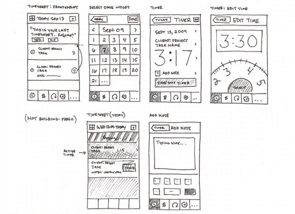

import {Callout} from 'nextra/components';
import {Bleed} from 'nextra-theme-docs';
import assignments from '~/utils/assignments';
import FormattedDate from '~/utils/FormattedDate';
import MilestoneCallout from '~/components/MilestoneCallout';

# Assignment 1 — Product Design

{assignments.product_design.show_updating_notice && <Callout type="warning"> The final project write-up is currently being updated. Details are tentative and will be finalised soon.</Callout>}

| Item | Due |
| :-- | :-- |
| Issue date | <FormattedDate date={assignments.product_design.issue} emphasize={false} /> |
| Final submission | <FormattedDate date={assignments.product_design.submission} emphasize={false} /> |

## General Overview

In this assignment, you will put on your designer hat and learn how to design a software product, coming up with ideas, features and designs. You will be guided on the various phases in designing your (possibly first) tech product.

## Grading and Admin

This assignment is designed for groups of three or four students. Groupings for all assignments will be formed in the first week of the course.

This assignment is highly open-ended. We provide milestones so that we can grade your application in a consistent way, even though everyone will be building different apps. This assignment is also designed to introduce you to the various phases of app design, and the milestones are there to ensure that you learn about the elements in a structured way. We will also provide some related tips, references and a little bit of help to get you started. These milestones constitute 70% of the assignment's grade.

While the milestones may be easy to meet, simply meeting them will not give you full credit. We ask for quality submissions, not run-of-the-mill work.

To score the coveted remaining 30%, use your creativity to design an application that stands out from the rest. We will not limit your potential by restricting the kind of applications you can build. We expect that you (pleasantly!) surprise us with what you are capable of doing.

Please do not hesitate to approach the friendly CS3216 staff if you need further assistance. We can be contacted at cs3216-staff@googlegroups.com.

## Objectives

The objective of this assignment is to ideate and design an app that solves a real problem, and use empirical user testing to validate your idea and design.

1. Your team will pick and target an audience to solve a common problem they face.
1. You will need to think critically about the features and user interactions needed within the product, and how each of these supports the user in solving the problem.
1. You will interview users and use your user research and user testing data to iterate on the product's UI design and user interactions.
1. The final deliverable will be a high fidelity interactive prototype that is sufficiently detailed to be handed off to a developer and turned into a working app.

<Callout type="warning">
  Please read the entire assignment before starting.
</Callout>

## Terminologies

In this assignment, we will use the following three terms when describing the designs we expect to see from you:

- **Wireframes:** Low fidelity designs without any design-specific elements such as colours or fonts.
- **Mockups:** High fidelity designs that are _static_. These designs may look close to the final product, but they cannot be interacted with.
- **Prototypes:** High fidelity designs that are interactive, i.e. a user can click on a button, and the prototype will transition to the appropriate screen or state.

We will also be asking for the submission of "user flows". In traditional user interface (UI) / user experience (UX) circles, these refer to flow chart diagrams that represent each screen as shapes. However, we will instead refer to what [Nielsen Norman Group](https://www.nngroup.com/) calls [_wireflows_](https://www.nngroup.com/articles/wireflows/) as user flows.

More information will be shared in the relevant sections.

## Phase 0

For this assignment, you will be designing and building a prototype that demonstrates your app's user flows. There are a large number of available UX design tools in the industry, but we recommend using Figma.

[Figma](https://www.figma.com/) is a design tool that is available as both a web and desktop application. Its most prominent feature is its support for real-time collaboration, allowing team members to work on the same wireframe, mockup or prototype simultaneously. As of 2022, Figma has been acquired by Adobe and is dominating the design tools market.

Figma also has community plugins available for additional functionality, such as [Iconify](https://www.figma.com/community/plugin/735098390272716381/Iconify), which collates over **50,000 icons** for use within your designs! Furthermore, students and educators can obtain a pro license from Figma for free. We recommend snagging your free pro license as soon as possible.

- [Figma community plugins](https://www.figma.com/community/plugins)
- [Figma template gallery](https://www.figma.com/templates/)

Figma variables were unveiled during [Config 2023](https://config.figma.com/) (Figma's annual user conference), and prototyping capabilities were drastically enhanced with new features that allow for more dynamic and realistic prototypes using fewer frames and interactions. It's even possible to build a [playable Flappy Bird game prototype](https://www.figma.com/community/file/1255294635761885013) using Figma variables.

Export your designs out as a `.fig` file when submitting. [Instructions can be found here](https://help.figma.com/hc/en-us/articles/360040028114-Guide-to-exports-in-Figma#Export_in_bulk) at the very bottom.

Apart from Figma, here are some other tools you may choose from:

- [InVision](https://www.invisionapp.com/): Their free plan allows users to have one prototype with unlimited screens and unlimited collaborators for an unlimited period of time.
- [Sketch](https://www.sketchapp.com/): An industry standard, but it is not free and available only on macOS.
- [Adobe XD](https://www.adobe.com/sea/products/xd.html): We used to recommend Adobe XD as an alternative but ever since Figma was acquired by Adobe, the app is discontinued.
- PowerPoint.
- Paper and pencil for wireframe sketches.

Whatever tool you choose, it has to be able to produce a prototype that fulfils all of the assignment's requirements. In particular, the final prototype needs to be **interactive** and **demonstrate user flows** through the app. Feel free to check with the teaching team if you are unsure about the tool you plan to use.

<MilestoneCallout customNumber="0a" labelSuffix="(Compulsory, not graded)">
  Describe your app in one paragraph. What does your app do and why? (You can
  come back and complete this milestone retroactively.)
</MilestoneCallout>

<MilestoneCallout customNumber="0b" labelSuffix="(Not graded)">
  Explore the available tools, pick a tool, and make sure everyone on your team
  is familiar with it.
</MilestoneCallout>

<MilestoneCallout customNumber="0c" labelSuffix="(Not graded)">
  Read through [Elly: Room/roommate finder mobile
  application](http://albancarmet.com/portfolio/elly/). This case study helps
  you to understand the importance of the User-Centered Design process and why
  the assignment is structured in this way.
</MilestoneCallout>

## Phase 1 — User Requirements Gathering

Every good app/platform/website/service begins with a problem they are looking to solve for a target user. As this assignment is due on <FormattedDate date={assignments.product_design.submission}/>, we recommend you pick a target user who is abundantly available around you, e.g. your fellow NUS students. This way, you can easily conduct your user testing.

Study your users. Think of a problem / pain point you think they are facing now. List down and substantiate the problems / pain points and assumptions you have about:

1. Why are they facing this problem?
1. How are they living/dealing with this problem now?
1. How can your product/service solve this problem?
1. What platform (desktop/mobile/app) will best serve to solve this problem?
1. Will your product/service solve this problem in a way that does not cause them more stress, effort and time?

List the above in a **user persona** card. A persona is a fictional representation of an ideal user of your product. You can have more than one user persona card if that helps you to better define your audience. There is no fixed format for this, but it should contain at the very least:

1. A portrait (you can use a stock photo)
1. Fictitious name for your user persona
1. Age, gender, current occupation
1. Answers to the problem / pain point and questions above

_Source: [Meetup: A Usability Case Study](https://uxdesign.cc/meetup-a-usability-case-study-e909c33f1e3e)_

You can fill in more information if you feel that that will help you better visualise your product, such as personality, brand affiliation, life goals and aspirations, level of experience with technology and more. The goal of the user persona is to allow you to think in the shoes of your user, so try to include details that make this easy.

Please also list down any assumptions about your user that will help us understand what you are validating about your users in the subsequent milestones.

<MilestoneCallout customNumber="1">
  Pick a primary user persona, list down and substantiate some assumptions about
  the problems they're facing now.
</MilestoneCallout>

Once you have listed these down, it is time to proceed to user interviews. The goal of this round of interviews is to validate your problem and assumptions about your users. It is important to remember that the earlier you reject a bad idea, the less costly it is.

- Identify users that fit your user persona cards
- Interview them about the problem(s) you think you are trying to solve
- Validate your assumptions
- Avoid asking leading questions

<MilestoneCallout>
  Formulate a set of questions that you think will help you validate your
  assumptions and understand the users' needs.
</MilestoneCallout>

<MilestoneCallout>
  Interview your users and validate your assumptions. Summarise the key findings
  and conclusions you draw from your interviews.
</MilestoneCallout>

## Phase 2 — Prototyping

After your interviews, list down at most three **primary user goals** your product should achieve. As a team, brainstorm features that would lead users to achieve these three primary user goals.

The features you pick should answer why they are necessary and how they reinforce your business idea. You should focus on quality and on the impact each feature will bring. Products are not successful just because of the number of features they have.

In general, remember that you are building a [Minimum Viable Product (MVP)](https://blog.ycombinator.com/minimum-viable-product-process/). The goal is not to build a complete feature set of the product; instead, the number of features should be just enough to test out your idea and validate that it is worth executing.

A good example is Instagram. They hit 100k users in a week without features such as hashtags or explore. Check out their [product timeline](https://en.wikipedia.org/wiki/Timeline_of_Instagram).

<Callout type="warning">
  Remember, more isn't always better. If you come up with fifteen features, you
  are doing it wrong! There should definitely be less than ten features that
  meet your three primary user goals.
</Callout>

At the same time, you should not omit essentials such as authentication and settings or the lack thereof. A large part of WhatsApp's popularity was due to simply having the phone number as the user account and their focus on the core essentials of messaging! [Threads](https://www.threads.net/), Meta's "Twitter killer", saw over 100 million sign ups in less than five days due to the ease of onboarding. It uses Instagram login and users can easily follow the same accounts they follow on Instagram.

As you are designing a product for the real world, it is also important to ensure that your ideas and business logic are sound, realistic, and executable. Answer these questions:

1. How will your product acquire users? Why will users use your product over what they are currently doing to solve the problem? Here are some guiding questions that might assist you in answering these questions:

   - What does your product bring to the table?
   - What differentiates it over the competition?
   - Why would someone choose your solution over another?

2. How will your product be executed? Here are some guiding questions that might assist you in answering this question:

   - What resources or data does your product need?
   - What are some stakeholders that you might have to work with?
   - Are there legal/bureaucratic restrictions and/or limitations in introducing such a product?
   - Are there social issues or barriers to consider, that might affect the adoption of your product?
   - What are some potential dealbreakers that could stop your product from reaching the market?

<MilestoneCallout>
  Based on the interview results, come up with a list of goals and features for
  your app. Be sure to answer the questions above.
</MilestoneCallout>

### Digression: Good Artists Copy; Great Artists Steal

You should do some research before starting to work on the designs. Professional designers do that all the time. Here are some articles and references to learn more about user interaction design:

- [10 Usability Heuristics for User Interface Design](https://www.nngroup.com/articles/ten-usability-heuristics/)
- [Usability 101: Introduction to Usability](https://www.nngroup.com/articles/usability-101-introduction-to-usability/)

You might also find pattern libraries useful. A pattern library is a collection of user interface design elements, such as a login page, a news feed, a profile page, a credit card entry screen, etc. They are recurring solutions that solve common design problems.

- [Mobbin](https://mobbin.com/): A website that showcases the various screens found within popular mobile and web apps that's very popular among the design community. It is founded by School of Computing alumni [Jiho Lim](https://www.linkedin.com/in/jiho/) and [Liau Jian Jie](https://www.linkedin.com/in/liaujianjie/) (CS3216 AY2019/20).
- [Page Flows](https://pageflows.com/): Covers user flows, screens and emails across various devices. Generous amount of free content.
- [UI Sources](https://www.uisources.com/): Another source for UI flow inspirations focusing on mobile apps and includes recordings of end to end user journeys (paid).

Platform-specific design resources:

- [Material Design Tools](https://material.io/): Official resource hub for Material Design, Google's open source design system. Useful if you want to pursue a Material design theme.
- [Apple Design Resources](https://developer.apple.com/design/resources/): Assets and tools for designing for Apple devices.

Other good resources for design inspiration include [Behance](https://www.behance.net/) and [Dribbble](https://dribbble.com/). They are websites used by designers to showcase their portfolio/work. You could think of them as LinkedIn for designers.

---

Now it is time to get your hands dirty!

<Bleed>
  <iframe
    src="https://www.youtube.com/embed/JMjozqJS44M?start=124"
    width="100%"
    height="500px"
  />
</Bleed>

Wireframes are ["low-fidelity" designs](https://www.nngroup.com/articles/ux-prototype-hi-lo-fidelity/). This means that they should _not_ contain any design-specific elements such as colours, font or unnecessary details like user-generated content and images. These distract from the aspects that are more important at this current stage of development, and slow down the speed at which they are produced. Instead, focus on the relative size and position of elements, key user interface elements, and interactions such as which elements can be clicked or tapped, dragged, and so on.

_Source: https://www.flickr.com/photos/anthonyarmendariz/4448219885/in/pool-1070674@N20/_

Use any tool you want — we recommend just plain paper, markers, and pencil. At this point, we value speed over quality since you will likely need to change them based on user feedback, so use whichever tool that allows you to do up wireframes the fastest.

Whichever tool you use to design your wireframes, make sure you can "transition" from different screens and states easily. If you are designing on paper, this means using a different page for each screen and sticky notes for modals, popups and other ephemeral UI elements, and if you are designing on PowerPoint, make each screen or state a slide. When you create your design, keep your user personas in mind.

<Callout type="warning">
  **Wireframes should be low-fidelity**. It is tempting to "skip steps" by using
  component kits or colourful designs that might add to the aesthetic of your
  wireframe. However, the point of wireframes is to be "ugly" and bare-bones so
  that you can be focused on **iterating on the idea and user flows quickly**,
  without being distracted by the aesthetics or colours for both you and your
  user. Please ensure that your wireframes are **low-fidelity**.
</Callout>

This set of wireframes will be shown to the user during testing. As such, keep a copy without the links between buttons and screens and without more than one screen showing at once — after all, users can't do that in the actual app! (You may add annotations or comments for your own reference, but remember to hide them before starting user testing.)

_Source: https://www.flickr.com/photos/mockupbuilder/12987528713/in/pool-ilovewireframes/_

<MilestoneCallout customNumber="5a">
  Design the first draft of your wireframes and save them under a folder named
  "Draft 1a". Your wireframes should adhere to the requirements above. If your
  draft is hand-drawn, scan or take a high-quality photo of it (make sure all
  important details are visible).
</MilestoneCallout>

Now, on top of your wireframes, sketch out the user flows for each of the major features you have listed above, e.g. links between buttons and screens. You may have more than one flow for each feature, and the flow can even start from outside your app. Similar to before, keep your user personas in mind when designing the user flows. Please keep these user flows as a separate copy, and you may bring all the screens together in a single document/image to better illustrate the flows between different screens.

These are some examples of user flows you may want to sketch out. In some cases, you may also have an explicit hypothesis you may wish to test.

- When the user hears about your app from a friend and visits your website or your app store page.
- What should you write on that website to entice users to click the "Sign Up" or "Download App" button?
- When users click "Sign Up", what do they see next? What details do they have to fill in? Are you making users go through too many steps before even signing up?
- When users login or use the app for the _first_ time, what do they see? What can they click on?
- When users login or use the app for the _second_ time, what do they see? What can they click on?

User flows should naturally intersect with each other. This is fine — real apps do not artificially limit the user in the ways they can be interacted with.

<MilestoneCallout customNumber="5b">
  Save a copy of these user flows under a folder named "Draft 1b". Clearly
  identify the main user flows. If your user flows are hand-drawn, scan or take
  a high-quality photo of it (make sure all important details are visible).
</MilestoneCallout>

## Phase 3 — User Interviews + Iterations

Now it's time to put your draft design to the test! The test we are conducting is sometimes called ["Wizard of Oz"](https://www.coursera.org/lecture/human-computer-interaction/wizard-of-oz-9f0pI) — we will simulate user interactions by taking the place of the computer. This may seem silly at first, but it is an important tool to validate your design at this stage. Here is a video that shows an example of this form of testing using paper prototypes.

<Bleed>
  <iframe
    src="https://www.youtube.com/embed/_g4GGtJ8NCY"
    width="100%"
    height="500px"></iframe>
</Bleed>

### Playing the Wizard of Oz

You may find it easier to conduct this form of testing in pairs. One of you will need to act as the computer, so you need a second person to record your results. Test with only one user at a time, not a group. This is to avoid one user's actions and opinions from influencing the results of other users.

Ask them for five to ten minutes of their time, and if they agree, start by giving them a little context for what you are about to show them. For instance, if the app in question is NUSMods, you might tell them that they have just received a link from a friend telling them to check out a new app for organising their NUS timetable. You may also give them an explicit goal to accomplish, such as "you would like to sign up for an account". They will need to achieve this goal by interacting with your wireframes. If you are conducting this virtually, the person acting as the computer can share their screen.

Instruct them to _think aloud_ and use their finger to point at where they will click or tap, or if you are doing this virtually, you can try using the tools available on your conferencing application (Zoom has Spotlight and Arrow available under its annotations panel). A quick way to explain "Think Aloud" to your users is "Vocalise your thoughts. Let us know what you're thinking throughout the way". Explain that you will be acting the part of the computer, and reassure them that there is no wrong answer. Do also tell the user to notify you if they are done using the app / website or do not have anything else to do. This will make it clear to you when the user has totally lost interest, given up on your UI, or has no more use for your website / app.

Now show the first wireframe they are supposed to see. Observe what they interact with first, second, third, etc. Remember to "transition" between your wireframes as illustrated in your user flows as the user interacts with them. **Do not** say anything during the whole process. If users become lost or confused, **let them be lost or confused**. Only prompt them for what they are thinking if it appears that they are not thinking aloud. If they get stuck, simply move onto the next set of wireframes.

At the same time, keep an eye out for their body language. See if they looked hesitant or disinterested at any point in time. Perhaps, they had to squint and lean in to read certain text that was too small. A lot of times, the users will not report such issues as they would assume that the problem lies with them and not with your design.

For any buttons or screens that you have not designed, you can reuse any existing wireframes and tell the users what they should see — "You clicked the _School of Computing_ link. We don't have those screens today. So please pretend that you see results for the School of Computing on this screen. Okay?". Alternatively, you can describe the result of the action to the user in words instead — "You see a pop up open with a yellow warning triangle, the text 'This will delete your results. Proceed?', and the buttons 'Okay' and 'Cancel'".

Remain as neutral as possible during testing. Only ask follow-up questions **after** the user testing session is completely over. This would be your chance to ask:

- Did you notice "X" button on this screen?
- Why did you click here and not there? What did you expect to happen when you clicked here?
- You seemed lost on this page. Why were you lost? What did you expect to happen?

Rinse and repeat with three to five different users. Does this seem too small a sample? See [Why You Only Need to Test with 5 Users](https://www.nngroup.com/articles/why-you-only-need-to-test-with-5-users/).

<MilestoneCallout customNumber="6">
  Document the results gathered from this round of testing with three to five
  different users. Be as detailed as possible. Things that would be good to
  document include user flow being tested currently, your observations, the
  questions you asked, their responses, and the issues identified. Save these
  into a new "Draft 1 Testing" folder.
</MilestoneCallout>

After you have completed the testing, it is now time to review the results and improve your user flow. For example, you may want to ask yourself:

- What did the user click on **first**? Was that what you wanted the user to click on **first**?
- Which features did users totally miss? Does that mean that those features are not important? If they're not important, throw them away. If they are, how can you revise your design so that users notice the features and actually click on them?
- Are there too many steps for the user to accomplish their goal? At which point did the user become visibly frustrated?
- What assumptions did you make when you created this design? Did the user testing confirm or reject these assumptions?

<MilestoneCallout>
  Review your results documented in Milestone 6, and revise both your wireframes
  and your user flows. Save the updated designs in folders named "Draft 2a" and
  "Draft 2b" respectively, and write about how the results from your interview
  have led to the changes in both the design and the flows.
</MilestoneCallout>

As you iterate on your design, remember to refine your sketches and improve their quality. Be bold in your earlier iterations. It is perfectly normal to throw out entire screens at this early stage. With each iteration, you should solidify your design — while earlier iterations may require large redesign, later iterations should only produce minor tweaks. Of course, make sure these changes are well-substantiated and well-documented.

## Phase 4 — Design Mockups/Prototypes + More Iterations

Now that you have the basic information architecture and user interactions planned out, it is time to add more meat to your wireframe. Convert your wireframe into a mockup using your chosen prototyping tool.

<Callout>
  If you feel that you are not ready for this stage yet, you may perform more
  rounds of design iteration and user testing with wireframes. Be sure to
  include the results and name the folders appropriately.
</Callout>

Compared to a wireframe, a mockup will usually look more similar to how the final app will turn out. Colours, fonts, logos, images and user interface elements from the target platform are used in place of wire boxes. However, like wireframes, mockups remain static and will require manual transitioning when doing user testing with them.

_Source: https://www.nngroup.com/articles/wireflows_

You may find it useful to develop a set of shared assets such as the app's logo, colour scheme, font and common UI elements so your mockup looks coherent when it is built by different members of the team. Figma supports [Components](https://help.figma.com/hc/en-us/articles/360038662654-Guide-to-components-in-Figma), which is a way to build elements you can reuse across your designs. You can give Figma components properties and compose them together, similar to UI library components in React/Vue/Angular. [Untitled UI](https://www.untitledui.com/) and [Riddle UI](https://www.riddleui.com/) are Figma UI kits / design systems that contain a good amount of free design system components you can use in your prototype. Figma components, used with Figma variables, empower teams to build consistent designs.

**If your team is feeling up to the task,** you may also choose to jump right into building a prototype, which is of higher fidelity than wireframes and is interactive. Testing with a high fidelity prototype should be the next best thing from testing with an actual working prototype. This allows for a stronger [suspension of disbelief](https://www.nngroup.com/articles/authentic-behavior-in-user-testing/), allowing the user to act more realistically. Your chosen prototyping tool should allow the user to directly click on elements, which should transition the prototype to the next screen or state. This also frees you from acting as the computer, which gives you more time to observe the user instead.

If you are planning to work on a prototype, there is no need to submit the design and user flows separately. Simply submit the interactive file in a single folder, as the **prototype transitions / interactions are basically your user flows**.

_Source: http://www.tifftam.co/goji/_

A well-developed app has many moving components — login, sign-up, active, inactive states and so on. While you do not have to include every single possibility that your user will encounter, it should be sufficient for your users to test it satisfactorily.

<MilestoneCallout customNumber="8a">
  Convert your wireframes into a high fidelity mockup or prototype. If you are
  designing a mockup, put the mockup in a folder called "Draft 3a", and the user
  flows (which should be based on the same mockup) in a folder called "Draft
  3b". If you are building a prototype, submit the interactive file in a single
  "Draft 3" folder.
</MilestoneCallout>

### More testing! More iterations!

Similar to Milestone 6, you must now test your high fidelity mockup or prototype with real users. At this stage, your mockup should be more complete, so there should be less shuffling around paper or clicking through slides. You can still step in for the computer for any screens or states which you have not added, or for interactions like drag and drop, which are less easy to prototype, but there should be less intervention on your part.

We strongly recommend testing at least once with an interactive prototype. Modern prototyping tools allow for precise configuration of transitions, and it would be good to test whether the transitions you plan to use between screens are intuitive to the users.

As you should already be fairly confident in your information structure and basic user interaction, you can instead focus on design details, usability and user experience. For instance, you may wish to check if the chosen colour and design of your primary [call to action](https://en.wikipedia.org/wiki/Call_to_action_%28marketing%29) button is sufficiently differentiated and noticeable. In addition, because you are using "production" colours, fonts and UI elements, you can test for a wider range of issues, such as legibility, engagement, and affordance (an object's properties that show the possible actions users can take with it, thereby suggesting how they may interact with that object).

However, remember that the primary goal of the testing is still to observe the user interact with the app. If you need to ask specific questions about elements of the design which the user did not comment on during testing, you should only do so at the end of the test.

<MilestoneCallout customNumber="8b" labelSuffix="(Optional)">
  Conduct two more rounds of user testing and iteration sessions. This means you
  should have "Draft 3 Testing", "Draft 4" (or "Draft 4a" and "Draft 4b" if
  you're building a mockup) and "Draft 4 Testing", each containing their
  respective drafts and testing results.
</MilestoneCallout>

## Final Prototype

With the previous draft's user testing results, you should come to a good conclusion on what your MVP should act and look like. The final **interactive** prototype should be complete and sufficiently detailed to be handed off to a developer to realise them. **Your prototype should include the onboarding, first use, and (if applicable) login flows.** Refer to Phase 0 instructions for the expected submission format for each of the prototyping tools.

Now, it's time to demonstrate how your app should work! Come together **as a team** (i.e., all members of your team should be present) and record a demo going through the happy paths of your application, i.e. the main success scenarios for your identified user flows. Keep the video short and sweet — give a short introduction about the problem your team is trying to solve before demonstrating the user flows. The video must be less than 5 minutes long and be submitted as a `.mp4` file.

<MilestoneCallout customNumber="9">
  Finalise the prototype, record the demo video and save both of them under a
  new folder "Final". Once again, since a prototype demonstrates the user flows,
  just submitting the prototype is sufficient.
</MilestoneCallout>

We want you to be aware that the different milestones in Assignment 1 have been structured for you to gain a good sense of what it takes to produce a Product Requirements Document (PRD), a document used in companies (Meta, Amazon, Google, many other tech companies...) to describe the product being built. The PRD is usually produced by the Product Manager and has to be approved before further product development can take place. Once produced, it drives the efforts of the entire product team and the company's sales, marketing and customer support efforts.

The broad structure of the PRD is as such:

1. Product Purpose (Milestones 1-3)

   - Description of the problem that you are trying to solve
   - High-level description of what the product does and how it solves the problem
   - Who is the product for

2. Competitive Analysis (Not included in Assignment 1)

   - Identify competitors who are launching similar products
   - Identify features of competitor's products worth emulating or avoiding
   - Identify the ways in which our product's features can deliver greater value than the competition

3. Features (Milestones 4-8)

   - Describe each feature at the level of interaction designs and use cases
   - Requirement traceability — identifying which requirements are in support of which objective
   - Metrics to be measured (Not covered in Assignment 1)

4. Schedule for Product Development (Not covered in Assignment 1)
   - Key milestones and overall timeline for product development

In particular, most of the PRD's importance is in the articulation of the product purpose (Milestones 1-3) and the features built to serve its purpose (Milestones 4-8). This is also what we are focusing on in this assignment. Hence, besides being mindful of how and why Assignment 1 is structured in this manner, you should also illustrate (to the best of your ability) how each feature addresses a particular aspect of a problem that your target user faces — what is known as requirements traceability — to demonstrate that your feature was developed and iterated with thought for the problem faced by the target user and not simply because it's cool or funky.

For further reading regarding PRDs during your free time, feel free to check out this [link](https://svpg.com/assets/Files/goodprd.pdf).

## Phase 5 — Growth Hacking

Growth hacking is defined as the process of rapid experimentation across a marketing funnel, product development, sales segments, and other areas of the business to identify the most efficient ways to grow a business. A common misconception about the term is that it has to do with coding.

A wonderful application is useless if there are no users using it! In this section we will discuss some ways to get users.

### Landing Page

When should you launch a website for your app? If your answer is to launch only after the app has been released, you are missing out! Just like movie trailers, which are released months before the actual launch of the movie, you can launch a landing page, which is a website designed to gauge interest and convert visitors into leads/users.

A landing page for an app that hasn't been launched should:

- Explain what your app is about and aims to generate interest in it.
- Contain a form that allows you to record a visitor's information (e.g. email). Businesses often promise some sort of deal or promo for the first X users who sign up. Another smart marketing tactic is to allow users to claim/reserve their username on your product, which creates a sense of scarcity (e.g. [Cal.com](https://cal.com/)).

Here are some resources and examples for building attractive landing pages:

- [One Page Love](https://onepagelove.com/)
- [SaaS landing page examples](https://saaslandingpage.com/)
- [6 Coming Soon Landing Page Examples to Build A Waitlist For Your Next Launch](https://www.convertflow.com/campaigns/coming-soon-landing-pages)
- [Landing Page Design Examples to Inspire Your Own in 2023](https://blog.hubspot.com/marketing/landing-page-examples-list)
- [20 Great Landing Page Examples You'll Want to Copy in 2023](https://blog.hubspot.com/marketing/fantastic-landing-page-examples)

<MilestoneCallout>
  Design and launch a landing page for your app that is publicly accessible. You
  should consider hosting it on [Vercel](https://vercel.com) or [GitHub
  pages](https://pages.github.com), but you can host it anywhere that works and
  just let us have the URL. It should have a sign-up form for users to indicate
  interest (it doesn't have to actually save any data).
</MilestoneCallout>

Use a CSS library/framework like [Tailwind UI](https://tailwindui.com/) or [Bootstrap](https://getbootstrap.com) to save yourself some time. Remember that the design has to be attractive and that your message has to be succinct! You can even consider no/low code solutions like like [Framer](https://framer.com/) or [MailChimp landing pages](https://mailchimp.com/features/landing-pages/) to skip all the work.

### Marketing Strategy

A landing page cannot effectively convert visitors into leads/users if there are no visitors to begin with! Going back to the movie trailers example, it would be like creating a movie trailer but not showing it through public display screens and television advertisements. Hence, you should think of some potential marketing strategies to get the word out about your app.

Positive examples:

- Make promotional videos. View past CS3216 final project videos [here](https://www.youtube.com/playlist?list=PL-0mdQVieeceaFm__nZYSQYzhDGF0C9Jg).
- [Griddit](https://www.facebook.com/griddit/posts/pfbid05iLEy2zMwY7N18yr5MzzaiyozHQPE2G2Z4kgHbQy4jiqtMjei56JxMrHizRo165ol), a live chat room app, got Prof Ben Leong to do an AMA using their service.
- [Letterbox](https://www.youtube.com/watch?v=7TnnLeSPnhA&index=6&t=0s&list=PL-0mdQVieeceaFm__nZYSQYzhDGF0C9Jg) had a member going around the school on an Airwheel and giving out flyers.

DO NOT:

- Paste unremovable stickers on the benches of the School of Computing.
- Put up posters in inappropriate places like restrooms.

Videos are not the only way to market an app — to obtain marks in the coveted 30%, think out of the box for non-disruptive, creative and effective marketing strategies. We want a well-thought-out marketing plan including details on how you would implement it. Your strategy must obviously be realistic, i.e. do not suggest giving out $10 to each user who downloads your app if you do not have a good plan of getting those funds or a millionaire on your team.

<MilestoneCallout>
  Design a small marketing campaign for your app. Explain which marketing
  channels you would use and how you would use them to get the word out about
  your app to attract more users. Provide implementation details (e.g. if you
  decide to make a promotional video, write out a brief outline of the video
  contents). Explain why you think your marketing strategy would be effective in
  gathering users.
</MilestoneCallout>

## Final Assignment Write-up

Your submission will include a write-up that describes how your group has met all the milestones for this assignment:

- It should contain answers to Milestones 1-4 and 10-11.
- It should also summarise your Milestones 5-9. More specifically, it should:
  - Make it clear how the designs are organised. Which ones are wireframes, mockups or prototypes?
  - Briefly recap the results and observations from your user testing results.
  - Highlight the main user flows presented in each draft / iteration submitted.

## Assessment Scheme

The grading of the assignment is divided into two components: satisfying the compulsory milestones (70%) and the coolness factor (30%). Excluding Milestone 0, there are **11 compulsory milestones** in total, along with an optional Milestone 8b. Milestones 5a and 5b are each worth 2.5%. Milestones 6, 7 and 9 are each worth 10%. The rest are worth 5% each.

The remaining 30% will be awarded based on the relative outcomes for the various teams. The top team might be awarded up to 30%, while the worst performing team less than 5%. The optional milestones can also contribute to this.

Overall, the product design assignment is worth 10% of your final grade.

## Mode of Submission

By <FormattedDate date={assignments.product_design.submission}/>, you should upload the following to Coursemology:

- Your final write-up named `group-<number>-milestones.pdf`
- Your designs and testing results — zipped together — named `group-<number>-designs.zip`

For submissions that are >1GB in size (which is the maximum upload size that Coursemology currently has), upload the zip file to Google Drive and submit a PDF file containing the link to your designs and testing results. Please make sure the last modified date time of your uploaded ZIP file on Google Drive is before the submission deadline.

<Callout>
  As a final reminder, you should have written answers for **six milestones**,
  **three or more drafts** comprising separate folders for the design, the user
  flows and user testing results and conclusions, **one final prototype**, and{' '}
  **one demo video** in your submission. **Failure to adhere to these
  instructions will result in the deduction of marks.** Only one member of your
  group needs to submit on Coursemology on behalf of your group.
</Callout>

Clarifications and questions related to this assignment should be posted to the Coursemology forum.

Good luck and have fun!
